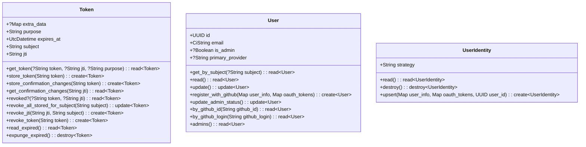

# Accounts - Class

```mermaid
classDiagram
  class `EhsEnforcement.Accounts.Token`["Token"] {
    +?Map extra_data
    +String purpose
    +UtcDatetime expires_at
    +String subject
    +String jti
    +get_token(?String token, ?String jti, ?String purpose) : read~Token~
    +store_token(String token) : create~Token~
    +store_confirmation_changes(String token) : create~Token~
    +get_confirmation_changes(String jti) : read~Token~
    +revoked?(?String token, ?String jti) : read~Token~
    +revoke_all_stored_for_subject(String subject) : update~Token~
    +revoke_jti(String jti, String subject) : create~Token~
    +revoke_token(String token) : create~Token~
    +read_expired() : read~Token~
    +expunge_expired() : destroy~Token~
  }
  class `EhsEnforcement.Accounts.User`["User"] {
    +UUID id
    +CiString email
    +?Boolean is_admin
    +?String primary_provider
    +get_by_subject(?String subject) : read~User~
    +read() : read~User~
    +update() : update~User~
    +register_with_github(Map user_info, Map oauth_tokens) : create~User~
    +update_admin_status() : update~User~
    +by_github_id(String github_id) : read~User~
    +by_github_login(String github_login) : read~User~
    +admins() : read~User~
  }
  class `EhsEnforcement.Accounts.UserIdentity`["UserIdentity"] {
    +String strategy
    +read() : read~UserIdentity~
    +destroy() : destroy~UserIdentity~
    +upsert(Map user_info, Map oauth_tokens, UUID user_id) : create~UserIdentity~
  }

```

---

**Generated**: 2025-10-20 16:10:08.743597Z

**Regenerate**: `mix diagrams.generate --domain accounts`
