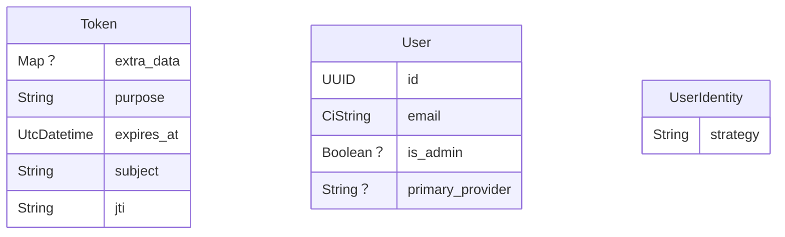

# Accounts - Entity relationship

```mermaid
erDiagram
  "EhsEnforcement.Accounts.Token"["Token"] {
    Map？ extra_data
    String purpose
    UtcDatetime expires_at
    String subject
    String jti
  }
  "EhsEnforcement.Accounts.User"["User"] {
    UUID id
    CiString email
    Boolean？ is_admin
    String？ primary_provider
  }
  "EhsEnforcement.Accounts.UserIdentity"["UserIdentity"] {
    String strategy
  }

```

---

**Generated**: 2025-10-20 16:10:08.363796Z

**Regenerate**: `mix diagrams.generate --domain accounts`
