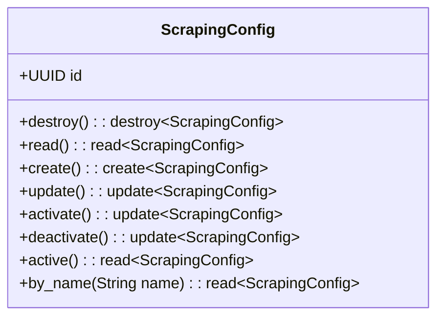

# Configuration - Class

```mermaid
classDiagram
  class `EhsEnforcement.Configuration.ScrapingConfig`["ScrapingConfig"] {
    +UUID id
    +destroy() : destroy~ScrapingConfig~
    +read() : read~ScrapingConfig~
    +create() : create~ScrapingConfig~
    +update() : update~ScrapingConfig~
    +activate() : update~ScrapingConfig~
    +deactivate() : update~ScrapingConfig~
    +active() : read~ScrapingConfig~
    +by_name(String name) : read~ScrapingConfig~
  }

```

---

**Generated**: 2025-10-20 16:10:10.278938Z

**Regenerate**: `mix diagrams.generate --domain configuration`
