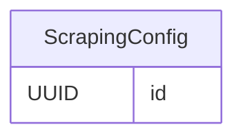

# Configuration - Entity relationship

```mermaid
erDiagram
  "EhsEnforcement.Configuration.ScrapingConfig"["ScrapingConfig"] {
    UUID id
  }

```

---

**Generated**: 2025-10-20 16:10:09.956937Z

**Regenerate**: `mix diagrams.generate --domain configuration`
