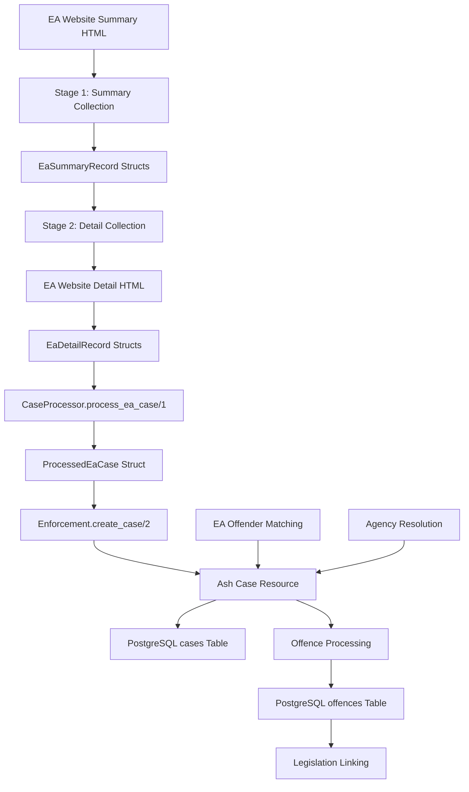

# EA Parser-Database Mapping Documentation

## Overview

This document maps the complete data transformation pipeline for EA (Environment Agency) enforcement actions, from raw HTML scraping through processing to PostgreSQL storage via Ash resources.

**Location**: `/admin/cases/scrape` → EA scraping functionality  
**Pipeline**: `HTML → EaSummaryRecord → EaDetailRecord → ProcessedEaCase → Ash Case Resource → PostgreSQL`

## Data Flow Architecture



## Two-Stage EA Scraping Pattern

Unlike HSE's page-based pagination, EA uses a unique two-stage pattern:

1. **Stage 1**: Single summary request returns ALL enforcement actions for date range
2. **Stage 2**: Individual detail page requests for each enforcement action (with rate limiting)

## Stage 1: HTML Summary → EaSummaryRecord Struct

### Source Module
- **File**: `lib/ehs_enforcement/scraping/ea/case_scraper.ex`
- **Entry Point**: `scrape_enforcement_actions/4`

### HTML Structure Parsed

#### Summary Page Structure
- **URL Pattern**: `https://environment.data.gov.uk/public-register/enforcement-action/registration?actionType={action_type_url}&after={date_from}&before=`
- **Action Types**: 
  - Court Case: `http://environment.data.gov.uk/public-register/enforcement-action/def/action-type/court-case`
  - Caution: `http://environment.data.gov.uk/public-register/enforcement-action/def/action-type/caution`
  - Enforcement Notice: `http://environment.data.gov.uk/public-register/enforcement-action/def/action-type/enforcement-notice`

#### HTML Table Structure
```html
<table>
  <tbody>
    <tr>
      <td><a href="/public-register/enforcement-action/registration/{record_id}">{offender_name}</a></td>
      <td>{address}</td>
      <td>{action_date}</td>
    </tr>
  </tbody>
</table>
```

### EaSummaryRecord Struct Definition

```elixir
defmodule EaSummaryRecord do
  defstruct [
    :ea_record_id,           # String - Extracted from detail URL (e.g., "10000368")
    :offender_name,          # String - Company/individual name
    :summary_address,        # String - Address from summary (may be incomplete)
    :action_date,           # Date - Enforcement action date
    :action_type,           # Atom - :court_case, :caution, :enforcement_notice
    :detail_url,            # String - Full URL to detail page
    :scraped_at             # DateTime - Timestamp
  ]
end
```

### HTML → EaSummaryRecord Field Mapping

| HTML Source | EaSummaryRecord Field | Transformation | Notes |
|-------------|----------------------|----------------|-------|
| `<a href="{url}">{name}</a>` | `:offender_name` | `Floki.text() \|> String.trim/1` | Main company name |
| `<a href="{url}">` | `:detail_url` | `build_absolute_detail_url/1` | Full URL construction |
| `<a href="{url}">` | `:ea_record_id` | `extract_record_id_from_url/1` | ID from URL path |
| `<td>{address}</td>` | `:summary_address` | `Floki.text() \|> String.trim/1` | May be empty |
| `<td>{date}</td>` | `:action_date` | `parse_ea_date/1` | Multiple date formats supported |
| Function parameter | `:action_type` | Direct assignment | From scraping parameters |

### Date Parsing Logic

```elixir
defp parse_ea_date(date_string) do
  cond do
    String.match?(date_string, ~r/^\d{2}\/\d{2}\/\d{4}$/) ->
      # DD/MM/YYYY format  
      [day, month, year] = String.split(date_string, "/")
      Date.from_erl!({String.to_integer(year), String.to_integer(month), String.to_integer(day)})
      
    String.match?(date_string, ~r/^\d{4}-\d{2}-\d{2}$/) ->
      # ISO format
      Date.from_iso8601!(date_string)
      
    true ->
      nil  # Unable to parse
  end
end
```

## Stage 2: Detail HTML → EaDetailRecord Struct

### Detail Page Structure
- **URL Pattern**: `https://environment.data.gov.uk/public-register/enforcement-action/registration/{record_id}`
- **HTML Format**: Definition list (`<dt>Label</dt><dd>Value</dd>`) or table-based layout

### EaDetailRecord Struct Definition

```elixir
defmodule EaDetailRecord do
  defstruct [
    # From summary (Stage 1)
    :ea_record_id,           # String - Primary identifier
    :offender_name,          # String - Company name
    :action_date,           # Date - Action date
    :action_type,           # Atom - Action type
    
    # Company information (Stage 2)
    :company_registration_number,  # String - Companies House number
    :industry_sector,        # String - Business sector
    :address,               # String - Street address
    :town,                  # String - Town
    :county,                # String - County
    :postcode,              # String - Postcode
    
    # Enforcement details (Stage 2)
    :total_fine,            # Decimal - Fine amount
    :offence_description,   # String - Description of offence
    :case_reference,        # String - EA case reference
    :event_reference,       # String - EA event ID
    :agency_function,       # String - EA department function
    
    # Environmental impact (Stage 2)
    :water_impact,          # String - Water impact level
    :land_impact,           # String - Land impact level
    :air_impact,            # String - Air impact level
    
    # Legal framework (Stage 2)
    :act,                   # String - Legal act name
    :section,               # String - Act section
    :legal_reference,       # String - Combined act + section
    
    # Metadata
    :scraped_at,            # DateTime - Detail scrape timestamp
    :detail_url             # String - Source URL
  ]
end
```

### HTML Detail → EaDetailRecord Field Mapping

| HTML Source | EaDetailRecord Field | Transformation | Notes |
|-------------|---------------------|----------------|-------|
| `<dt>Company No.</dt><dd>{value}</dd>` | `:company_registration_number` | `extract_field/2` | Companies House number |
| `<dt>Industry Sector</dt><dd>{value}</dd>` | `:industry_sector` | `extract_field/2` | Business classification |
| `<dt>Address</dt><dd>{value}</dd>` | `:address` | `extract_field/2` | Street address |
| `<dt>Town</dt><dd>{value}</dd>` | `:town` | `extract_field/2` | Town name |
| `<dt>County</dt><dd>{value}</dd>` | `:county` | `extract_field/2` | County name |
| `<dt>Postcode</dt><dd>{value}</dd>` | `:postcode` | `extract_field/2` | UK postcode |
| `<dt>Total Fine</dt><dd>{value}</dd>` | `:total_fine` | `extract_and_parse_fine/2` | £5,000 → Decimal("5000.00") |
| `<dt>Offence</dt><dd>{value}</dd>` | `:offence_description` | `extract_field/2` | Description text |
| `<dt>Case Reference</dt><dd>{value}</dd>` | `:case_reference` | `extract_field/2` | EA internal reference |
| `<dt>Event Reference</dt><dd>{value}</dd>` | `:event_reference` | `extract_field/2` | EA event ID |
| `<dt>Agency Function</dt><dd>{value}</dd>` | `:agency_function` | `extract_field/2` | Department/function |
| `<dt>Water Impact</dt><dd>{value}</dd>` | `:water_impact` | `extract_field/2` | Impact level |
| `<dt>Land Impact</dt><dd>{value}</dd>` | `:land_impact` | `extract_field/2` | Impact level |
| `<dt>Air Impact</dt><dd>{value}</dd>` | `:air_impact` | `extract_field/2` | Impact level |
| `<dt>Act</dt><dd>{value}</dd>` | `:act` | `extract_field/2` | Legal act name |
| `<dt>Section</dt><dd>{value}</dd>` | `:section` | `extract_field/2` | Act section |

### Field Extraction Functions

```elixir
defp extract_field(document, field_label) do
  # Primary: Definition list format
  case Floki.find(document, "dt:fl-contains('#{field_label}')") do
    [_dt] ->
      case Floki.find(document, "dt:fl-contains('#{field_label}') + dd") do
        [dd] -> dd |> Floki.text() |> String.trim()
        _ -> nil
      end
    _ ->
      # Fallback: table-based layouts
      extract_field_from_table(document, field_label)
  end
end

defp extract_and_parse_fine(document, field_label) do
  case extract_field(document, field_label) do
    nil -> Decimal.new(0)
    fine_str ->
      case Regex.run(~r/[\d,]+\.?\d*/, fine_str) do
        [number_str] ->
          number_str |> String.replace(",", "") |> Decimal.new()
        _ -> Decimal.new(0)
      end
  end
end
```

## Stage 3: EaDetailRecord → ProcessedEaCase Transformation

### Source Module
- **File**: `lib/ehs_enforcement/scraping/ea/case_processor.ex`
- **Entry Point**: `process_ea_case/1`

### ProcessedEaCase Struct Definition

```elixir
defmodule ProcessedEaCase do
  @derive Jason.Encoder
  defstruct [
    # Core identifiers (mapped from EA data)
    :regulator_id,           # String - Generated from EA record ID
    :agency_code,           # Atom - Always :environment_agency
    :offender_attrs,        # Map - Structured offender data for Ash resource
    
    # Standard enforcement details (HSE-compatible)
    :offence_result,        # String - Mapped from action_type
    :offence_fine,          # Decimal - From total_fine
    :offence_costs,         # Decimal - Always 0 (EA doesn't separate costs)
    :offence_action_date,   # Date - From action_date
    :offence_hearing_date,  # Date - Always nil (EA doesn't provide)
    :offence_breaches,      # String - From offence_description
    :offence_breaches_clean, # String - Processed legal reference
    :regulator_function,    # String - Normalized agency_function
    :regulator_url,         # String - Detail page URL
    :related_cases,         # String - Always nil (could be enhanced)
    :offence_action_type,   # String - Mapped to HSE-compatible format
    
    # EA-specific fields (schema extensions)
    :ea_event_reference,    # String - EA event ID
    :ea_total_violation_count, # Integer - Detected violation count
    :environmental_impact,   # String - Impact assessment ("major"/"minor"/"none")
    :environmental_receptor, # String - Primary receptor affected ("land"/"water"/"air")
    :is_ea_multi_violation, # Boolean - Multi-violation case detection
    
    # Source metadata
    :source_metadata,       # Map - EA scraping metadata
    
    # Multi-offence data (for Offence resources)
    :violations_data        # List - Offence structs for bulk creation via unified offences table
  ]
end
```

### EaDetailRecord → ProcessedEaCase Field Mapping

| EaDetailRecord Field | ProcessedEaCase Field | Transformation | Business Logic |
|---------------------|---------------------|----------------|----------------|
| `:ea_record_id` | `:regulator_id` | `"EA_#{ea_record_id}"` | Prefixed unique ID |
| N/A | `:agency_code` | `:environment_agency` | Hard-coded agency identifier |
| Multiple fields | `:offender_attrs` | `build_ea_offender_attrs/1` | Structured offender data |
| `:action_type` | `:offence_result` | `map_ea_action_to_result/1` | Business logic mapping |
| `:total_fine` | `:offence_fine` | Direct copy | Already Decimal |
| N/A | `:offence_costs` | `Decimal.new(0)` | EA doesn't separate costs |
| `:action_date` | `:offence_action_date` | Direct copy | Already Date |
| N/A | `:offence_hearing_date` | `nil` | EA doesn't provide hearing dates |
| `:offence_description` | `:offence_breaches` | Direct copy | Description text |
| `:act`, `:section` | `:offence_breaches_clean` | `build_legal_reference/1` | Formatted legal reference |
| `:agency_function` | `:regulator_function` | `normalize_ea_function/1` | Prefixed with "Environmental - " |
| `:detail_url` | `:regulator_url` | Direct copy | Source URL |
| `:action_type` | `:offence_action_type` | `map_ea_action_to_hse_type/1` | HSE-compatible format |

### EA-Specific Field Processing

#### Action Type Mapping
```elixir
defp map_ea_action_to_result(action_type) do
  case action_type do
    :court_case -> "Court Action"
    :caution -> "Formal Caution"
    :enforcement_notice -> "Enforcement Notice Issued"
    _ -> "Regulatory Action"
  end
end

defp map_ea_action_to_hse_type(action_type) do
  case action_type do
    :court_case -> "Court Case"
    :caution -> "Formal Caution"  
    :enforcement_notice -> "Enforcement Notice"
    _ -> "Other"
  end
end
```

#### Environmental Impact Assessment
```elixir
defp assess_environmental_impact(%EaDetailRecord{} = ea_record) do
  impacts = [ea_record.water_impact, ea_record.land_impact, ea_record.air_impact]
  
  cond do
    Enum.any?(impacts, &(&1 == "major")) -> "major"
    Enum.any?(impacts, &(&1 == "minor")) -> "minor"
    true -> "none"
  end
end

defp detect_primary_receptor(%EaDetailRecord{} = ea_record) do
  case {ea_record.water_impact, ea_record.land_impact, ea_record.air_impact} do
    {"major", _, _} -> "water"
    {_, "major", _} -> "land"
    {_, _, "major"} -> "air"
    {"minor", _, _} -> "water"
    {_, "minor", _} -> "land"
    {_, _, "minor"} -> "air"
    _ -> "land"  # Default to land for general environmental cases
  end
end
```

### EA Offender Data Processing

```elixir
defp build_ea_offender_attrs(%EaDetailRecord{} = ea_record) do
  %{
    name: ea_record.offender_name,
    address: build_full_address(ea_record),
    local_authority: ea_record.county,  # Use county as local authority
    postcode: ea_record.postcode,
    main_activity: ea_record.industry_sector,
    industry: map_ea_industry_to_hse_category(ea_record.industry_sector),
    
    # EA-specific fields (schema extensions)
    company_registration_number: ea_record.company_registration_number,
    town: ea_record.town,
    county: ea_record.county,
    business_type: determine_and_normalize_business_type(ea_record.offender_name)
  }
  |> remove_nil_values()
end

defp build_full_address(%EaDetailRecord{} = ea_record) do
  [ea_record.address, ea_record.town, ea_record.county, ea_record.postcode]
  |> Enum.filter(&(&1 != nil and &1 != ""))
  |> Enum.join(", ")
end
```

### Industry Classification Mapping

```elixir
defp map_ea_industry_to_hse_category(nil), do: "Unknown"
defp map_ea_industry_to_hse_category(ea_industry) when is_binary(ea_industry) do
  ea_lower = String.downcase(ea_industry)
  
  cond do
    String.contains?(ea_lower, "manufacturing") -> "Manufacturing"
    String.contains?(ea_lower, "construction") -> "Construction"
    String.contains?(ea_lower, ["water", "supply", "utility"]) -> "Extractive and utility supply industries"
    String.contains?(ea_lower, ["agriculture", "farming", "forestry", "fishing"]) -> "Agriculture hunting forestry and fishing"
    String.contains?(ea_lower, ["service", "management", "transport", "retail"]) -> "Total service industries"
    true -> "Unknown"
  end
end
```

## Stage 4: ProcessedEaCase → Ash Case Resource

### Source Module
- **File**: `lib/ehs_enforcement/scraping/ea/case_processor.ex`
- **Entry Point**: `create_ea_case/2`

### Ash Resource Mapping

The EA processor creates Ash Case resources using the same schema as HSE, but with EA-specific extensions:

### ProcessedEaCase → Ash Case Attributes Mapping

| ProcessedEaCase Field | Ash Attribute | PostgreSQL Column | Type | EA-Specific |
|---------------------|---------------|-------------------|------|-------------|
| `:regulator_id` | `:regulator_id` | `regulator_id` | `varchar` | Prefixed "EA_" |
| `:offence_result` | `:offence_result` | `offence_result` | `varchar` | Mapped from action_type |
| `:offence_fine` | `:offence_fine` | `offence_fine` | `decimal(10,2)` | Direct from EA |
| `:offence_costs` | `:offence_costs` | `offence_costs` | `decimal(10,2)` | Always 0 |
| `:offence_action_date` | `:offence_action_date` | `offence_action_date` | `date` | Direct from EA |
| `:offence_hearing_date` | `:offence_hearing_date` | `offence_hearing_date` | `date` | Always NULL |
| `:regulator_function` | `:regulator_function` | `regulator_function` | `varchar` | "Environmental - {function}" |
| `:regulator_url` | `:regulator_url` | `regulator_url` | `varchar` | EA detail page URL |
| `:offence_action_type` | `:offence_action_type` | `offence_action_type` | `varchar` | Mapped to HSE format |
| `:ea_event_reference` | `:ea_event_reference` | `ea_event_reference` | `varchar` | **EA-only** |
| `:ea_total_violation_count` | `:ea_total_violation_count` | `ea_total_violation_count` | `integer` | **EA-only** |
| `:environmental_impact` | `:environmental_impact` | `environmental_impact` | `varchar` | **EA-only** |
| `:environmental_receptor` | `:environmental_receptor` | `environmental_receptor` | `varchar` | **EA-only** |
| `:is_ea_multi_violation` | `:is_ea_multi_violation` | `is_ea_multi_violation` | `boolean` | **EA-only** |

## Stage 5: EA Offender Resource Processing

### EA-Enhanced Offender Schema

EA cases populate additional offender fields not available from HSE:

| EA Field | Offender Attribute | PostgreSQL Column | EA Enhancement |
|----------|-------------------|-------------------|----------------|
| `:company_registration_number` | `:company_registration_number` | `company_registration_number` | **EA-only** |
| `:town` | `:town` | `town` | **EA-only** |
| `:county` | `:county` | `county` | **EA-only** |
| `:industry_sector` | `:industry_sectors` | `industry_sectors` | **EA-only** (array) |

### Enhanced Deduplication for EA

EA cases use enhanced offender matching that considers:
1. **Company Registration Number**: Exact match for registered companies
2. **Name + Postcode**: Standard normalized matching
3. **Geographic Matching**: County/town matching for better accuracy

## Multi-Offence Processing

EA cases can have complex offence structures. The processor detects and handles these through the unified `offences` table:

### Multi-Offence Detection
```elixir
defp is_multi_violation_case?(%EaDetailRecord{} = ea_record) do
  case_ref = ea_record.case_reference || ""
  # EA multi-violation cases often have numbered case references
  String.contains?(case_ref, "/01") or String.contains?(case_ref, "/02")
end
```

### Offence Resource Creation
For multi-violation EA cases, separate `offences` table entries are created via the unified Offence resource:

```elixir
defp build_violations_data(%EaDetailRecord{} = ea_record) do
  if is_multi_violation_case?(ea_record) do
    [%{
      sequence_number: 1,
      offence_reference: ea_record.case_reference,
      fine: ea_record.total_fine || Decimal.new(0),
      offence_description: ea_record.offence_description,
      legislation_part: build_legislation_part(ea_record.act, ea_record.section),
      # legislation_id will be resolved during offence creation
    }]
  else
    []  # Single violation cases don't need separate Offence resources
  end
end
```

## Stage 6: Legislation Parsing & Linking

### Source Module
- **File**: `lib/ehs_enforcement/enforcement/resources/legislation.ex`
- **Table**: `legislation` (PostgreSQL)

### EA Legislation Processing

EA enforcement data includes structured legal references that must be parsed and linked to normalized legislation records:

#### EA Legal Data Structure
EA detail pages provide:
- **Act**: Full act name (e.g., "Environmental Protection Act")  
- **Section**: Specific section/regulation (e.g., "Section 33")
- **Legal Reference**: Combined reference from `build_legal_reference/1`

### Legislation Resource Schema

```elixir
defmodule EhsEnforcement.Enforcement.Legislation do
  attributes do
    uuid_primary_key :id
    
    attribute :legislation_title, :string, allow_nil?: false
    # e.g., "Environmental Protection Act"
    
    attribute :legislation_year, :integer
    # e.g., 1990
    
    attribute :legislation_number, :integer  
    # e.g., 43 (chapter number)
    
    attribute :legislation_type, :atom, allow_nil?: false
    # :act, :regulation, :order, :acop
  end
end
```

### EA → Legislation Mapping Process

#### 1. Legal Reference Parsing
```elixir
defp build_legal_reference(%EaDetailRecord{} = ea_record) do
  case {ea_record.act, ea_record.section} do
    {act, section} when is_binary(act) and is_binary(section) ->
      "#{String.trim(act)} - #{String.trim(section)}"
    {act, _} when is_binary(act) -> String.trim(act)
    _ -> ea_record.offence_description
  end
end
```

#### 2. Legislation Lookup & Creation
The system uses a multi-step process to find or create legislation records:

```elixir
defp find_or_create_legislation(act_name, year \\ nil) do
  # Step 1: Normalize act name for consistent matching
  normalized_title = normalize_legislation_title(act_name)
  
  # Step 2: Extract year from title if not provided
  {clean_title, extracted_year} = extract_year_from_title(normalized_title)
  final_year = year || extracted_year
  
  # Step 3: Search for existing legislation
  case search_existing_legislation(clean_title, final_year) do
    {:ok, legislation} -> 
      {:ok, legislation}
    
    {:error, :not_found} ->
      # Step 4: Create new legislation record
      create_legislation_record(clean_title, final_year)
  end
end
```

#### 3. EA Act Name Normalization
EA act names require normalization to match standard legal references:

```elixir
defp normalize_legislation_title(act_name) do
  act_name
  |> String.trim()
  |> String.replace(~r/\s+/, " ")                    # Single spaces
  |> String.replace(~r/&/, "and")                    # & → and
  |> String.replace(~r/\bAct\b.*$/i, "Act")         # Remove trailing text after "Act"
  |> String.replace(~r/\bRegulations?\b.*$/i, "Regulations")  # Same for Regulations
  |> normalize_common_ea_acts()
end

defp normalize_common_ea_acts(title) do
  case String.downcase(title) do
    # Common EA act variations
    text when String.contains?(text, "environmental protection") ->
      "Environmental Protection Act"
    
    text when String.contains?(text, "water resources") ->
      "Water Resources Act"
    
    text when String.contains?(text, "pollution prevention") ->
      "Pollution Prevention and Control Act"
    
    text when String.contains?(text, "waste management") ->
      "Environmental Protection Act"  # Waste management typically under EP Act
    
    text when String.contains?(text, "contaminated land") ->
      "Environmental Protection Act"  # Part 2A covers contaminated land
    
    text when String.contains?(text, "radioactive substances") ->
      "Radioactive Substances Act"
    
    _ -> title  # Return as-is if no specific normalization
  end
end
```

#### 4. Year Extraction from EA Legal Text
```elixir
defp extract_year_from_title(title) do
  case Regex.run(~r/(\d{4})/, title) do
    [_, year_str] -> 
      clean_title = String.replace(title, ~r/\s*\d{4}\s*/, " ") |> String.trim()
      {clean_title, String.to_integer(year_str)}
    
    nil -> 
      {title, guess_year_from_title(title)}
  end
end

defp guess_year_from_title(title) do
  # Common EA legislation years based on title patterns
  case String.downcase(title) do
    text when String.contains?(text, "environmental protection") -> 1990
    text when String.contains?(text, "water resources") -> 1991  
    text when String.contains?(text, "pollution prevention") -> 1999
    text when String.contains?(text, "radioactive substances") -> 1993
    _ -> nil  # Unable to guess
  end
end
```

### Legislation Table Structure

```sql
CREATE TABLE legislation (
    id UUID PRIMARY KEY DEFAULT gen_random_uuid(),
    legislation_title VARCHAR NOT NULL,
    legislation_year INTEGER CHECK (legislation_year >= 1800 AND legislation_year <= 2100),
    legislation_number INTEGER CHECK (legislation_number >= 1),
    legislation_type VARCHAR NOT NULL CHECK (legislation_type IN ('act', 'regulation', 'order', 'acop')),
    created_at TIMESTAMP NOT NULL DEFAULT NOW(),
    updated_at TIMESTAMP NOT NULL DEFAULT NOW(),
    
    UNIQUE(legislation_title, legislation_year, legislation_number)
);

-- Performance indexes
CREATE INDEX legislation_type_index ON legislation (legislation_type);
CREATE INDEX legislation_year_index ON legislation (legislation_year);
CREATE INDEX legislation_title_gin_trgm ON legislation USING GIN (legislation_title gin_trgm_ops);
```

### EA Offence → Legislation Linking

When creating EA offences, the system links to legislation records:

```elixir
defp create_ea_offence(case_id, ea_detail_record) do
  # 1. Find or create legislation record
  {:ok, legislation} = find_or_create_legislation(
    ea_detail_record.act, 
    extract_year_from_act_name(ea_detail_record.act)
  )
  
  # 2. Create offence with legislation link
  offence_attrs = %{
    case_id: case_id,
    legislation_id: legislation.id,
    offence_description: ea_detail_record.offence_description,
    offence_reference: ea_detail_record.case_reference,
    legislation_part: ea_detail_record.section,  # "Section 33", etc.
    fine: ea_detail_record.total_fine || Decimal.new(0),
    sequence_number: 1
  }
  
  Enforcement.create_offence(offence_attrs)
end
```

### Common EA Legislation Examples

#### Environmental Protection Act 1990
- **EA Act Field**: "Environmental Protection Act 1990"
- **Normalized Title**: "Environmental Protection Act"
- **Year**: 1990
- **Type**: `:act`
- **Common Sections**: "Section 33", "Section 34", "Part 2A"

#### Water Resources Act 1991  
- **EA Act Field**: "Water Resources Act 1991"
- **Normalized Title**: "Water Resources Act"
- **Year**: 1991
- **Type**: `:act`
- **Common Sections**: "Section 85", "Section 161"

#### Pollution Prevention and Control Regulations 2000
- **EA Act Field**: "Pollution Prevention and Control (England and Wales) Regulations 2000"
- **Normalized Title**: "Pollution Prevention and Control Regulations"
- **Year**: 2000  
- **Type**: `:regulation`
- **Common Sections**: "Regulation 32", "Regulation 38"

### Legislation Linking Performance

The legislation linking process includes optimizations:

1. **Caching**: Recently created legislation records cached in memory
2. **Batch Processing**: Bulk legislation creation for large scraping sessions
3. **Fuzzy Matching**: pg_trgm similarity matching for act name variations
4. **Fallback Creation**: Auto-create missing legislation with warnings

### Error Handling in Legislation Processing

```elixir
defp handle_legislation_error(ea_record, error) do
  Logger.warning("Failed to process legislation for EA record #{ea_record.ea_record_id}: #{inspect(error)}")
  
  case error do
    :invalid_act_format ->
      # Create generic "Unknown Environmental Act" entry
      create_fallback_legislation(ea_record.offence_description)
      
    :duplicate_legislation ->
      # Race condition - try to find the created record
      search_existing_legislation_with_retry(ea_record.act)
      
    _ ->
      # Log error and create without legislation link (will be fixed manually)
      {:error, :legislation_processing_failed}
  end
end
```

### Debugging Legislation Issues

#### Common Problems
1. **Act Name Variations**: Same act with different formatting in EA data
2. **Missing Years**: EA sometimes omits enactment years
3. **Section Format Inconsistency**: "Section 33" vs "s.33" vs "33"
4. **Regulation vs Act Confusion**: Misclassified legislation types

#### Debugging Commands
```elixir
# Check legislation matching
iex> EhsEnforcement.Enforcement.search_legislation("Environmental Protection")

# Verify offence → legislation links
iex> EhsEnforcement.Enforcement.list_offences_by_legislation(legislation_id)

# Find unlinked offences (missing legislation_id)
iex> EhsEnforcement.Enforcement.list_offences() 
     |> Enum.filter(&(is_nil(&1.legislation_id)))
```

## PostgreSQL Schema Extensions for EA

### EA-Specific Case Fields

```sql
-- EA-specific extensions in cases table
ALTER TABLE cases ADD COLUMN ea_event_reference VARCHAR;
ALTER TABLE cases ADD COLUMN ea_total_violation_count INTEGER;
ALTER TABLE cases ADD COLUMN environmental_impact VARCHAR CHECK (environmental_impact IN ('none', 'minor', 'major'));
ALTER TABLE cases ADD COLUMN environmental_receptor VARCHAR CHECK (environmental_receptor IN ('land', 'water', 'air'));
ALTER TABLE cases ADD COLUMN is_ea_multi_violation BOOLEAN DEFAULT FALSE;
```

### EA-Enhanced Offender Fields

```sql  
-- EA-specific extensions in offenders table
ALTER TABLE offenders ADD COLUMN company_registration_number VARCHAR;
ALTER TABLE offenders ADD COLUMN town VARCHAR;
ALTER TABLE offenders ADD COLUMN county VARCHAR;
ALTER TABLE offenders ADD COLUMN industry_sectors VARCHAR[] DEFAULT '{}';
```

### Unified Offences Table (EA Multi-Offence Support)

The unified `offences` table consolidates the previous separate `breaches` (HSE) and `violations` (EA) tables:

```sql
CREATE TABLE offences (
    id UUID PRIMARY KEY DEFAULT gen_random_uuid(),
    case_id UUID REFERENCES cases(id) ON DELETE CASCADE,
    notice_id UUID REFERENCES notices(id) ON DELETE CASCADE,
    legislation_id UUID NOT NULL REFERENCES legislation(id),
    
    -- Core offence details
    offence_description TEXT,
    offence_reference VARCHAR,  -- EA case reference (e.g., 'SW/A/2010/2051079/01')
    
    -- Legislation details
    legislation_part VARCHAR,   -- 'Section 33', 'Regulation 4', etc.
    
    -- Financial and sequence information (primarily for EA cases)
    fine DECIMAL(10,2) DEFAULT 0 CHECK (fine >= 0),
    sequence_number INTEGER CHECK (sequence_number >= 1),
    
    created_at TIMESTAMP NOT NULL DEFAULT NOW(),
    updated_at TIMESTAMP NOT NULL DEFAULT NOW(),
    
    -- Constraints
    UNIQUE(offence_reference) WHERE offence_reference IS NOT NULL,
    UNIQUE(case_id, sequence_number) WHERE case_id IS NOT NULL AND sequence_number IS NOT NULL,
    CHECK (case_id IS NOT NULL OR notice_id IS NOT NULL)
);

-- Performance indexes
CREATE INDEX offences_case_id_index ON offences (case_id);
CREATE INDEX offences_notice_id_index ON offences (notice_id);
CREATE INDEX offences_legislation_id_index ON offences (legislation_id);
CREATE INDEX offences_case_sequence_index ON offences (case_id, sequence_number);
CREATE INDEX offences_legislation_fine_index ON offences (legislation_id, fine);

-- pg_trgm indexes for fuzzy search
CREATE INDEX offences_description_gin_trgm ON offences USING GIN (offence_description gin_trgm_ops);
CREATE INDEX offences_reference_gin_trgm ON offences USING GIN (offence_reference gin_trgm_ops);
CREATE INDEX offences_legislation_part_gin_trgm ON offences USING GIN (legislation_part gin_trgm_ops);
```

## Performance Considerations

### Two-Stage Rate Limiting
- **Stage 1**: Single request per action type (no rate limiting needed)
- **Stage 2**: Configurable delay between detail requests (default 3 seconds)

```elixir
# Rate limiting between detail requests
delay_ms = Keyword.get(opts, :detail_delay_ms, @default_detail_delay_ms)  # 3000ms
Process.sleep(delay_ms)
```

### Batch Processing Optimizations
- **Duplicate Detection**: Bulk query for existing EA cases before creation
- **Bulk Violation Creation**: `bulk_create_offences/2` for multi-violation cases
- **Connection Pooling**: Shared PostgreSQL connections for efficiency

## EA-Specific Error Handling

### Company Registration Number Conflicts
- **Issue**: Same company number, different names
- **Handling**: Log warning, prefer most recent data

### Missing Environmental Impact Data
- **Issue**: Some EA records lack impact classification
- **Handling**: Default to "none" impact, "land" receptor

### Date Format Variations
- **Issue**: EA uses multiple date formats (DD/MM/YYYY, ISO)
- **Handling**: `parse_ea_date/1` with multiple format support

## Data Quality Considerations

### EA Data Completeness
- **Company Registration Numbers**: ~70% of EA cases include Companies House numbers
- **Environmental Impact**: ~60% include structured impact data
- **Geographic Data**: ~95% include town/county information

### Validation Rules
- **Total Fine**: Must be >= 0, defaults to 0 if unparseable
- **Action Date**: Must be valid date, rejects malformed entries
- **Company Names**: Cannot be empty, validated before processing

## Common Issues & Debugging

### EA Website Structure Changes
- **Symptoms**: Empty EaDetailRecord structs, parsing failures
- **Debugging**: Check `extract_field/2` pattern matching
- **Solution**: Update field labels in case_scraper.ex

### Rate Limiting Issues
- **Symptoms**: HTTP timeout errors, incomplete detail fetching
- **Debugging**: Monitor network requests and timing
- **Solution**: Adjust `detail_delay_ms` parameter

### Multi-Offence Detection Issues
- **Symptoms**: Missing offence records for complex EA cases
- **Debugging**: Examine `is_multi_violation_case?/1` logic
- **Solution**: Enhance case reference pattern matching

## Testing EA Data Flow

### Unit Tests
```bash
# Test EA HTML parsing
mix test test/ehs_enforcement/scraping/ea/case_scraper_test.exs

# Test EA case processing
mix test test/ehs_enforcement/scraping/ea/case_processor_test.exs

# Test EA data transformation
mix test test/ehs_enforcement/agencies/ea/data_transformer_test.exs
```

### Integration Tests
```bash
# Test complete EA pipeline
mix test test/ehs_enforcement/scraping/workflows/ea_scraping_integration_test.exs

# Test EA offender deduplication
mix test test/ehs_enforcement/agencies/ea/duplicate_handling_test.exs
```

## Comparison with HSE Pipeline

| Aspect | HSE Pipeline | EA Pipeline |
|--------|-------------|-------------|
| **Scraping Pattern** | Multi-page pagination | Two-stage (summary + details) |
| **Rate Limiting** | Between pages | Between detail requests |
| **Data Richness** | Basic enforcement data | Environmental impact + company data |
| **Offence Handling** | Single string | Multi-offence support via unified offences table |
| **Geographic Data** | Local authority only | Town + county + postcode |
| **Legal Framework** | Breach descriptions | Structured act + section |
| **Company Identification** | Name-based only | Companies House numbers |

This documentation provides comprehensive coverage of the EA enforcement action pipeline, enabling effective development, debugging, and maintenance of the EA scraping system.