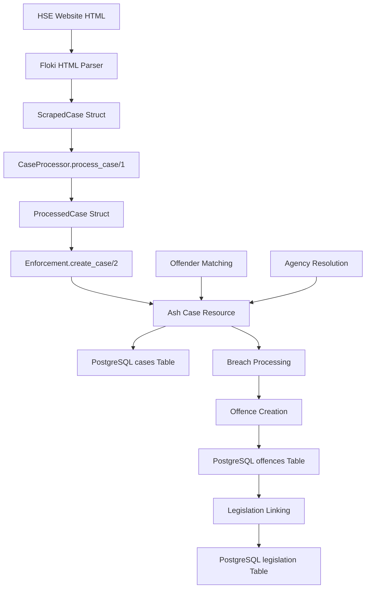

# HSE Parser-Database Mapping Documentation

## Overview

This document maps the complete data transformation pipeline for HSE (Health & Safety Executive) enforcement cases, from raw HTML scraping through processing to PostgreSQL storage via Ash resources.

**Location**: `/admin/cases/scrape` → HSE scraping functionality  
**Pipeline**: `HTML → ScrapedCase → ProcessedCase → Ash Case Resource → PostgreSQL`

## Data Flow Architecture



## Stage 1: HTML Scraping → ScrapedCase Struct

### Source Module
- **File**: `lib/ehs_enforcement/scraping/hse/case_scraper.ex`
- **Entry Point**: `scrape_page/2` or `scrape_case_by_id/2`

### HTML Structure Parsed
HSE website provides enforcement data in two page types:

#### Page 1: Case List Pages
- **URL Pattern**: `https://resources.hse.gov.uk/{database}/case/case_list.asp?PN={page}&ST=C&EO=LIKE&SN=F&SF=DN&SV=&SO=DODS`
- **HTML Structure**: Table rows with 5 columns
```html
<tr>
  <td><a href="case_details.asp?SF=CN&SV={regulator_id}">{regulator_id}</a></td>
  <td>{offender_name}</td>
  <td>{offence_action_date}</td>
  <td>{offender_local_authority}</td>
  <td>{offender_main_activity}</td>
</tr>
```

#### Page 2: Case Detail Pages
- **URL Pattern**: `https://resources.hse.gov.uk/{database}/case/case_details.asp?SF=CN&SV={regulator_id}`
- **HTML Structure**: Definition list or table format with additional fields

### ScrapedCase Struct Definition

```elixir
defmodule ScrapedCase do
  @derive Jason.Encoder
  defstruct [
    # From case list page (Stage 1)
    :regulator_id,           # String - Primary identifier (e.g., "HSE_20240001")
    :offender_name,          # String - Company/individual name
    :offence_action_date,    # Date - Court action date
    :offender_local_authority, # String - Local authority area
    :offender_main_activity,   # String - Business activity description
    
    # From case detail page (Stage 2)
    :offender_industry,      # String - Industry classification
    :offence_result,         # String - Court result (e.g., "Fined")
    :offence_fine,           # Decimal - Fine amount
    :offence_costs,          # Decimal - Cost amount awarded to HSE
    :offence_hearing_date,   # Date - Court hearing date
    :offence_breaches,       # String - Concatenated breach descriptions
    :offence_number,         # Integer - Count of breaches
    :regulator_function,     # String - HSE department function
    :related_cases,          # String - Comma-separated related case IDs
    
    # Metadata
    :page_number,            # Integer - Source page number
    :scrape_timestamp        # DateTime - When scraped
  ]
end
```

### HTML → ScrapedCase Field Mapping

| HTML Source | ScrapedCase Field | Transformation | Notes |
|-------------|-------------------|----------------|-------|
| `<td><a>{regulator_id}</a></td>` | `:regulator_id` | `String.trim/1` | Primary key |
| `<td>{offender_name}</td>` | `:offender_name` | `String.trim/1` | Company/individual |
| `<td>{offence_action_date}</td>` | `:offence_action_date` | `Utility.iso_date/1` | DD/MM/YYYY → Date |
| `<td>{offender_local_authority}</td>` | `:offender_local_authority` | `String.trim/1` | Geographic area |
| `<td>{offender_main_activity}</td>` | `:offender_main_activity` | `String.trim/1` | Business activity |
| Detail page: "Total Fine" cell | `:offence_fine` | `parse_monetary_amount/1` | £5,000 → Decimal("5000.00") |
| Detail page: "Total Costs" cell | `:offence_costs` | `parse_monetary_amount/1` | £1,500 → Decimal("1500.00") |
| Detail page: breach links | `:offence_breaches` | `fetch_breach_details/2` | Follows URLs to get breach text |
| Detail page: "HSE Directorate" | `:regulator_function` | `upcase_first_from_upcase_phrase/1` | Normalize case |

### Key Parsing Functions

```elixir
# Monetary amount parsing
defp parse_monetary_amount(amount_str) do
  case Regex.run(~r/[\d,]+\.?\d*/, amount_str) do
    [number_str] ->
      number_str |> String.replace(",", "") |> Decimal.new()
    _ -> Decimal.new("0")
  end
end

# Date parsing utility
def iso_date(date_string) do
  # Converts DD/MM/YYYY to Date struct
  # Handles various HSE date formats
end
```

## Stage 2: ScrapedCase → ProcessedCase Transformation

### Source Module
- **File**: `lib/ehs_enforcement/scraping/hse/case_processor.ex`
- **Entry Point**: `process_case/1`

### ProcessedCase Struct Definition

```elixir
defmodule ProcessedCase do
  @derive Jason.Encoder
  defstruct [
    # Identifiers
    :regulator_id,           # String - Preserved from ScrapedCase
    :agency_code,           # Atom - Always :hse
    
    # Processed offender data
    :offender_attrs,        # Map - Structured offender data for Ash resource
    
    # Enforcement details
    :offence_result,        # String - Preserved from ScrapedCase
    :offence_fine,          # Decimal - Preserved from ScrapedCase
    :offence_costs,         # Decimal - Preserved from ScrapedCase
    :offence_action_date,   # Date - Preserved from ScrapedCase
    :offence_hearing_date,  # Date - Preserved from ScrapedCase
    :offence_breaches,      # String - Preserved from ScrapedCase
    :offence_breaches_clean, # String - Processed breach text
    :offence_lrt,           # String - Legislation reference (future)
    :regulator_function,    # String - Preserved from ScrapedCase
    :regulator_url,         # String - Generated detail page URL
    :related_cases,         # String - Preserved from ScrapedCase
    :offence_action_type,   # String - Always "Court Case" for HSE
    
    # Metadata
    :source_metadata        # Map - Scraping metadata
  ]
end
```

### ScrapedCase → ProcessedCase Field Mapping

| ScrapedCase Field | ProcessedCase Field | Transformation | Business Logic |
|-------------------|-------------------|----------------|----------------|
| `:regulator_id` | `:regulator_id` | Direct copy | Preserved as unique identifier |
| N/A | `:agency_code` | Set to `:hse` | Hard-coded agency identifier |
| Multiple fields | `:offender_attrs` | `build_offender_attrs/1` | Structured data for Offender resource |
| `:offence_result` | `:offence_result` | Direct copy | Court judgment text |
| `:offence_fine` | `:offence_fine` | Direct copy | Already Decimal from parsing |
| `:offence_costs` | `:offence_costs` | Direct copy | Already Decimal from parsing |
| `:offence_action_date` | `:offence_action_date` | Direct copy | Already Date from parsing |
| `:offence_hearing_date` | `:offence_hearing_date` | Direct copy | Already Date from parsing |
| `:offence_breaches` | `:offence_breaches` | Direct copy | Raw breach text |
| `:offence_breaches` | `:offence_breaches_clean` | `process_breaches/2` | Cleaned and processed |
| `:regulator_id` | `:regulator_url` | `build_regulator_url/1` | Generate HSE detail page URL |
| `:related_cases` | `:related_cases` | Direct copy | Comma-separated case IDs |
| N/A | `:offence_action_type` | Set to "Court Case" | Hard-coded for HSE cases |

### Offender Data Processing

The `build_offender_attrs/1` function creates structured offender data:

```elixir
defp build_offender_attrs(%ScrapedCase{} = scraped_case) do
  %{
    name: scraped_case.offender_name,
    local_authority: scraped_case.offender_local_authority,
    main_activity: scraped_case.offender_main_activity,
    industry: scraped_case.offender_industry,
    business_type: determine_and_normalize_business_type(scraped_case.offender_name)
  }
  |> remove_nil_values()
end
```

### Business Type Detection

```elixir
defp determine_business_type(offender_name) do
  cond do
    Regex.match?(~r/LLC|llc/, offender_name) -> "LLC"
    Regex.match?(~r/[Ii]nc$/, offender_name) -> "INC"
    Regex.match?(~r/[ ][Cc]orp[. ]/, offender_name) -> "CORP"
    Regex.match?(~r/PLC|[Pp]lc/, offender_name) -> "PLC"
    Regex.match?(~r/[Ll]imited|LIMITED|Ltd|LTD|Lld/, offender_name) -> "LTD"
    Regex.match?(~r/LLP|[Ll]lp/, offender_name) -> "LLP"
    true -> "SOLE"
  end
end

defp normalize_business_type(business_type_string) do
  case business_type_string do
    "LTD" -> :limited_company
    "PLC" -> :plc
    "LLP" -> :partnership
    "LLC" -> :limited_company
    "INC" -> :limited_company
    "CORP" -> :limited_company
    "SOLE" -> :individual
    _ -> :other
  end
end
```

## Stage 3: ProcessedCase → Ash Case Resource

### Source Module
- **File**: `lib/ehs_enforcement/scraping/hse/case_processor.ex`
- **Entry Point**: `create_case/2`

### Ash Resource Definition
- **File**: `lib/ehs_enforcement/enforcement/resources/case.ex`
- **Table**: `cases` (PostgreSQL)

### ProcessedCase → Ash Case Attributes Mapping

| ProcessedCase Field | Ash Attribute | PostgreSQL Column | Type | Constraints |
|-------------------|---------------|-------------------|------|-------------|
| `:regulator_id` | `:regulator_id` | `regulator_id` | `varchar` | unique, not null |
| `:offence_result` | `:offence_result` | `offence_result` | `varchar` | - |
| `:offence_fine` | `:offence_fine` | `offence_fine` | `decimal(10,2)` | >= 0 |
| `:offence_costs` | `:offence_costs` | `offence_costs` | `decimal(10,2)` | >= 0 |
| `:offence_action_date` | `:offence_action_date` | `offence_action_date` | `date` | - |
| `:offence_hearing_date` | `:offence_hearing_date` | `offence_hearing_date` | `date` | - |
| `:offence_breaches` | N/A | N/A | - | Stored in separate `offences` table |
| `:offence_breaches_clean` | N/A | N/A | - | Processed for offences linkage |
| `:regulator_function` | `:regulator_function` | `regulator_function` | `varchar` | - |
| `:regulator_url` | `:regulator_url` | `regulator_url` | `varchar` | - |
| `:related_cases` | `:related_cases` | `related_cases` | `varchar` | - |
| `:offence_action_type` | `:offence_action_type` | `offence_action_type` | `varchar` | - |

### Foreign Key Relationships

The Ash Case resource establishes these relationships during creation:

#### Agency Relationship
```elixir
# From agency_code (:hse) to Agency resource
case EhsEnforcement.Enforcement.get_agency_by_code(:hse) do
  {:ok, agency} -> 
    # Sets agency_id foreign key
    |> Ash.Changeset.force_change_attribute(:agency_id, agency.id)
end
```

#### Offender Relationship
```elixir
# From offender_attrs to Offender resource (find or create)
case EhsEnforcement.Enforcement.Offender.find_or_create_offender(offender_attrs) do
  {:ok, offender} ->
    # Sets offender_id foreign key
    |> Ash.Changeset.force_change_attribute(:offender_id, offender.id)
end
```

## Stage 4: Offender Resource Processing

### Source Module
- **File**: `lib/ehs_enforcement/enforcement/resources/offender.ex`
- **Table**: `offenders` (PostgreSQL)

### Offender Deduplication Logic

The `find_or_create_offender/1` function implements sophisticated deduplication:

1. **Primary Match**: Exact match on `normalized_name` + `postcode`
2. **Fuzzy Search**: PostgreSQL `pg_trgm` GIN index for similar names
3. **Similarity Scoring**: Jaccard + Jaro-Winkler similarity algorithms
4. **Postcode Conflict Detection**: Prevents merging companies with different locations

### Offender Attributes Processing

| ProcessedCase `offender_attrs` | Ash Offender Attribute | PostgreSQL Column | Transformation |
|-------------------------------|----------------------|------------------|----------------|
| `:name` | `:name` | `name` | Direct copy |
| `:name` | `:normalized_name` | `normalized_name` | `normalize_company_name/1` |
| `:local_authority` | `:local_authority` | `local_authority` | Direct copy |
| `:main_activity` | `:main_activity` | `main_activity` | Direct copy |
| `:industry` | `:industry` | `industry` | Direct copy |
| `:business_type` | `:business_type` | `business_type` | Enum: `:limited_company`, `:individual`, etc. |

### Company Name Normalization

```elixir
def normalize_company_name(name) do
  name
  |> String.trim()
  |> String.downcase()
  |> String.replace(~r/[\.,:;!@#$%^&*()]+/, "")  # Remove punctuation
  |> String.replace(~r/\s+(limited|ltd\.?)$/i, " limited")  # Normalize "Ltd"
  |> String.replace(~r/\s+(plc|p\.l\.c\.?)$/i, " plc")     # Normalize "PLC"
  |> String.replace(~r/\s+/, " ")  # Single spaces
  |> String.trim()
end
```

## Stage 5: Legislation Parsing & Linking

### Source Module
- **File**: `lib/ehs_enforcement/agencies/hse/breaches.ex`
- **Target Table**: `legislation` (PostgreSQL)
- **Bridge Table**: `offences` (links cases to legislation)

### HSE Breach Structure & Parsing

HSE cases include complex breach information that must be parsed into structured legislation references:

#### HSE Breach Data Format
HSE breach strings follow patterns like:
- `"Health and Safety at Work Act 1974 / Section 2(1)"`
- `"Construction (Design and Management) Regulations 2015 / Regulation 13"`
- `"PUWER 1998 / Regulation 4 / Regulation 9"`

#### Breach Parsing Pipeline
```elixir
defp split_breach_into_title_year_article(breach) when is_binary(breach) do
  breach
  |> String.trim()
  |> String.trim_trailing(" /")
  |> String.split("/")
  |> Enum.map(&String.trim/1)
  |> case do
    [title_year, article, sub_article] ->
      Map.merge(title_year(title_year), %{article: article, sub_article: sub_article})

    [title_year, article] ->
      Map.merge(title_year(title_year), %{article: article})

    [title_year] ->
      title_year(title_year)
  end
end
```

### HSE Legislation Processing

#### 1. Title and Year Extraction
```elixir
defp title_year(title_year) do
  case Regex.run(~r/^(.*?)[ ](\d{4})/, title_year) do
    [_, title, year] ->
      %{title: clean_title(title), year: year}

    nil ->
      %{title: clean_title(title_year)}
  end
end
```

#### 2. HSE-Specific Title Normalization
HSE breach strings require extensive normalization to match standard legislation titles:

```elixir
defp clean_title(title) do
  title
  |> String.replace(~r/Regs/, "Regulations")
  |> String.replace(~r/[ ]{2,}/, " ")  # Multiple spaces → single space
  |> String.replace(~r/&/, "and")     # & → and
  |> String.replace(~r/Equip/, "Equipment")
  |> expand_common_hse_abbreviations()
  |> fix_hse_title_variations()
end

defp expand_common_hse_abbreviations(title) do
  case title do
    # Common HSE abbreviations
    "PUWER" -> "Provision and Use of Work Equipment Regulations"
    "COSHH" -> "Control of Substances Hazardous to Health Regulations"
    "DSEAR" -> "Dangerous Substances and Explosive Atmospheres Regulations"
    "LOLER" -> "Lifting Operations and Lifting Equipment Regulations"
    "CDM" -> "Construction (Design and Management) Regulations"
    "COMAH" -> "Control of Major Accident Hazards Regulations"
    text -> text
  end
end
```

#### 3. HSE Legislation Lookup Table
The system maintains a comprehensive lookup table for HSE legislation:

```elixir
@hse_legislation_lookup %{
  "health and safety at work act 1974" =>
    {"Health and Safety at Work etc. Act", "ukpga", "1974", "37"},
  "control of substances hazardous to health regulations 2002" =>
    {"Control of Substances Hazardous to Health Regulations", "uksi", "2002", "2677"},
  "construction (design and management) regulations 2015" =>
    {"Construction (Design and Management) Regulations", "uksi", "2015", "51"},
  "work at height regulations 2005" =>
    {"Work at Height Regulations", "uksi", "2005", "735"},
  # ... 50+ more HSE legislation entries
}
```

### HSE → Legislation Resource Mapping

#### Legislation Resource Schema (Shared with EA)
```elixir
defmodule EhsEnforcement.Enforcement.Legislation do
  attributes do
    uuid_primary_key :id
    
    attribute :legislation_title, :string, allow_nil?: false
    # e.g., "Health and Safety at Work etc. Act"
    
    attribute :legislation_year, :integer
    # e.g., 1974
    
    attribute :legislation_number, :integer  
    # e.g., 37 (chapter/SI number)
    
    attribute :legislation_type, :atom, allow_nil?: false
    # :act, :regulation, :order, :acop
  end
end
```

#### HSE Legislation Type Classification
```elixir
defp classify_hse_legislation_type(type_code) do
  case type_code do
    "ukpga" -> :act      # UK Public General Act
    "uksi" -> :regulation # UK Statutory Instrument (Regulations)
    "ukla" -> :act       # UK Local Act
    "acop" -> :acop      # Approved Code of Practice
    _ -> :regulation     # Default for HSE
  end
end
```

### HSE Offence Creation Process

When processing HSE cases, individual offences are created for each breach:

```elixir
defp create_hse_offences(case_id, breaches_clean, breaches_lrt) do
  # Parse individual breaches from concatenated string
  individual_breaches = String.split(breaches_clean, "\n")
  legislation_refs = String.split(breaches_lrt, ",")
  
  individual_breaches
  |> Enum.with_index()
  |> Enum.map(fn {breach_text, index} ->
    # Find or create legislation record
    {:ok, legislation} = find_or_create_hse_legislation(breach_text)
    
    # Extract section information
    {description, section} = extract_section_from_breach(breach_text)
    
    %{
      case_id: case_id,
      legislation_id: legislation.id,
      offence_description: description,
      legislation_part: section,  # "Section 2(1)", "Regulation 13", etc.
      sequence_number: index + 1,
      fine: calculate_proportional_fine(case_total_fine, length(individual_breaches), index)
    }
  end)
  |> create_offences_batch()
end
```

#### Section Extraction from HSE Breaches
```elixir
defp extract_section_from_breach(breach_text) do
  case Regex.run(~r/^(.+?) - (.+)$/, breach_text) do
    [_, act_title, section] ->
      # Extract clean description and section reference
      description = extract_offence_description(section)
      section_ref = normalize_section_reference(section)
      {description, section_ref}
    
    nil ->
      # No section specified - general breach of act
      {breach_text, nil}
  end
end

defp normalize_section_reference(section_text) do
  section_text
  |> String.replace(~r/^Section /, "Section ")  # Ensure "Section" prefix
  |> String.replace(~r/^Regulation /, "Regulation ")  # Ensure "Regulation" prefix  
  |> String.replace(~r/^reg (\d+)/i, "Regulation \\1")  # "reg 4" → "Regulation 4"
  |> String.replace(~r/^s\.?(\d+)/i, "Section \\1")    # "s.2" → "Section 2"
end
```

### Common HSE Legislation Examples

#### Health and Safety at Work etc. Act 1974
- **HSE Breach Text**: "Health and Safety at Work Act 1974 / Section 2(1)"
- **Normalized Title**: "Health and Safety at Work etc. Act"
- **Year**: 1974, **Number**: 37, **Type**: `:act`
- **Common Sections**: "Section 2(1)", "Section 3(1)", "Section 37"

#### Construction (Design and Management) Regulations 2015
- **HSE Breach Text**: "CDM Regulations 2015 / Regulation 13"
- **Normalized Title**: "Construction (Design and Management) Regulations"
- **Year**: 2015, **Number**: 51, **Type**: `:regulation`
- **Common Sections**: "Regulation 13", "Regulation 22", "Regulation 35"

#### Control of Substances Hazardous to Health Regulations 2002
- **HSE Breach Text**: "COSHH 2002 / Regulation 7"
- **Normalized Title**: "Control of Substances Hazardous to Health Regulations"
- **Year**: 2002, **Number**: 2677, **Type**: `:regulation`
- **Common Sections**: "Regulation 6", "Regulation 7", "Regulation 9"

### HSE Missing Year Recovery

HSE breach data sometimes omits years. The system includes recovery logic:

```elixir
defp get_missing_year(title) do
  case String.downcase(title) do
    text when String.contains?(text, "electricity at work") -> "1989"
    text when String.contains?(text, "workplace") and String.contains?(text, "welfare") -> "1992"
    text when String.contains?(text, "manual handling") -> "1992"
    text when String.contains?(text, "first-aid") -> "1981"
    text when String.contains?(text, "employers' liability") -> "1998"
    text when String.contains?(text, "corporate manslaughter") -> "2007"
    # ... additional recovery patterns
    _ -> nil
  end
end
```

### Unified Offences Table Structure

The offences table handles both HSE and EA cases with shared schema:

```sql
CREATE TABLE offences (
    id UUID PRIMARY KEY DEFAULT gen_random_uuid(),
    case_id UUID REFERENCES cases(id) ON DELETE CASCADE,
    notice_id UUID REFERENCES notices(id) ON DELETE CASCADE,
    legislation_id UUID NOT NULL REFERENCES legislation(id),
    
    -- Core offence details
    offence_description TEXT,
    offence_reference VARCHAR,  -- HSE: NULL, EA: case reference
    
    -- Legislation details  
    legislation_part VARCHAR,   -- "Section 2(1)", "Regulation 13", etc.
    
    -- Financial and sequence information
    fine DECIMAL(10,2) DEFAULT 0 CHECK (fine >= 0),
    sequence_number INTEGER CHECK (sequence_number >= 1),
    
    created_at TIMESTAMP NOT NULL DEFAULT NOW(),
    updated_at TIMESTAMP NOT NULL DEFAULT NOW(),
    
    -- Constraints
    UNIQUE(case_id, sequence_number) WHERE case_id IS NOT NULL AND sequence_number IS NOT NULL,
    CHECK (case_id IS NOT NULL OR notice_id IS NOT NULL)
);
```

### HSE Legislation Linking Performance

#### Optimizations for HSE Processing:
1. **Legislation Cache**: In-memory cache of recently created legislation records
2. **Batch Offence Creation**: Process all breaches for a case in single transaction
3. **Pre-compiled Patterns**: Regex patterns pre-compiled for performance
4. **Lookup Table**: Direct hash lookup for known HSE legislation titles

#### Fine Distribution Logic:
```elixir
defp calculate_proportional_fine(total_fine, breach_count, _index) do
  case {total_fine, breach_count} do
    {fine, 1} -> fine  # Single breach gets full fine
    {fine, count} when count > 1 ->
      # Distribute fine equally across breaches
      Decimal.div(fine, count) |> Decimal.round(2)
    _ -> Decimal.new(0)
  end
end
```

### Error Handling in HSE Legislation Processing

```elixir
defp handle_hse_legislation_error(breach_text, error) do
  Logger.warning("Failed to process HSE legislation: #{breach_text} - #{inspect(error)}")
  
  case error do
    :unknown_abbreviation ->
      # Create generic HSE legislation entry
      create_generic_hse_legislation(breach_text)
      
    :missing_year ->
      # Try year recovery, then create with estimated year
      estimated_year = guess_hse_legislation_year(breach_text)
      create_hse_legislation_with_year(breach_text, estimated_year)
      
    :duplicate_legislation ->
      # Race condition - search again
      search_existing_hse_legislation_with_retry(breach_text)
      
    _ ->
      # Log for manual review
      {:error, :hse_legislation_processing_failed}
  end
end
```

### HSE vs EA Legislation Processing Comparison

| Aspect | HSE Processing | EA Processing |
|--------|---------------|---------------|
| **Data Source** | Concatenated breach strings | Structured act + section fields |
| **Abbreviations** | Extensive (PUWER, COSHH, CDM) | Minimal (full act names) |
| **Section Format** | "Section 2(1)", "Regulation 13" | "Section 33", "Part 2A" |
| **Year Recovery** | Complex logic for missing years | Usually present in EA data |
| **Lookup Strategy** | Static lookup table | Dynamic normalization |
| **Common Legislation** | H&S-focused (workplace safety) | Environmental (pollution, waste) |

### Debugging HSE Legislation Issues

#### Common Problems:
1. **Abbreviation Variations**: "PUWER" vs "Provision and Use of Work Equipment"
2. **Missing Years**: Older HSE data may lack enactment years
3. **Section Formatting**: "s.2(1)" vs "Section 2(1)" vs "section 2(1)"
4. **Multiple Breaches**: Complex parsing when multiple acts are violated

#### Debugging Commands:
```elixir
# Test HSE breach parsing
iex> EhsEnforcement.Agencies.Hse.Breaches.split_breach_into_title_year_article("PUWER 1998 / Regulation 4")

# Check legislation lookup
iex> EhsEnforcement.Enforcement.search_legislation("Health and Safety at Work")

# Find HSE cases with offence parsing issues
iex> EhsEnforcement.Enforcement.list_offences() 
     |> Enum.filter(&(String.contains?(&1.offence_description || "", "ERROR")))

# Verify offence distribution for HSE case
iex> case_id = "uuid-here"
iex> EhsEnforcement.Enforcement.list_offences_by_case(case_id)
     |> Enum.map(&{&1.legislation_part, &1.fine})
```

## PostgreSQL Schema Structure

### cases Table

```sql
CREATE TABLE cases (
    id UUID PRIMARY KEY DEFAULT gen_random_uuid(),
    agency_id UUID NOT NULL REFERENCES agencies(id),
    offender_id UUID NOT NULL REFERENCES offenders(id),
    regulator_id VARCHAR UNIQUE NOT NULL,  -- HSE case ID
    offence_result VARCHAR,
    offence_fine DECIMAL(10,2) DEFAULT 0,
    offence_costs DECIMAL(10,2) DEFAULT 0,
    offence_action_date DATE,
    offence_hearing_date DATE,
    regulator_function VARCHAR,
    regulator_url VARCHAR,
    related_cases VARCHAR,  -- Comma-separated case IDs
    offence_action_type VARCHAR,
    inserted_at TIMESTAMP NOT NULL DEFAULT NOW(),
    updated_at TIMESTAMP NOT NULL DEFAULT NOW()
);

-- Performance indexes
CREATE INDEX cases_offence_action_date_index ON cases (offence_action_date);
CREATE INDEX cases_agency_id_index ON cases (agency_id);
CREATE INDEX cases_agency_date_index ON cases (agency_id, offence_action_date);
CREATE INDEX cases_regulator_id_gin_trgm ON cases USING GIN (regulator_id gin_trgm_ops);
```

### offenders Table

```sql
CREATE TABLE offenders (
    id UUID PRIMARY KEY DEFAULT gen_random_uuid(),
    name VARCHAR NOT NULL,
    normalized_name VARCHAR,  -- For deduplication
    address VARCHAR,
    local_authority VARCHAR,
    postcode VARCHAR,
    main_activity VARCHAR,
    industry VARCHAR,
    business_type VARCHAR CHECK (business_type IN ('limited_company', 'individual', 'partnership', 'plc', 'other')),
    agencies VARCHAR[] DEFAULT '{}',  -- Array of agency names
    
    -- Statistics (denormalized for performance)
    first_seen_date DATE,
    last_seen_date DATE,
    total_cases INTEGER DEFAULT 0,
    total_notices INTEGER DEFAULT 0,
    total_fines DECIMAL(12,2) DEFAULT 0,
    
    inserted_at TIMESTAMP NOT NULL DEFAULT NOW(),
    updated_at TIMESTAMP NOT NULL DEFAULT NOW(),
    
    UNIQUE(normalized_name, postcode)
);

-- pg_trgm indexes for fuzzy search
CREATE INDEX offenders_name_gin_trgm ON offenders USING GIN (name gin_trgm_ops);
CREATE INDEX offenders_normalized_name_gin_trgm ON offenders USING GIN (normalized_name gin_trgm_ops);
CREATE INDEX offenders_agencies_gin ON offenders USING GIN (agencies);
```

### legislation Table

```sql
CREATE TABLE legislation (
    id UUID PRIMARY KEY DEFAULT gen_random_uuid(),
    legislation_title VARCHAR NOT NULL,
    legislation_year INTEGER CHECK (legislation_year >= 1800 AND legislation_year <= 2100),
    legislation_number INTEGER CHECK (legislation_number >= 1),
    legislation_type VARCHAR NOT NULL CHECK (legislation_type IN ('act', 'regulation', 'order', 'acop')),
    created_at TIMESTAMP NOT NULL DEFAULT NOW(),
    updated_at TIMESTAMP NOT NULL DEFAULT NOW(),
    
    UNIQUE(legislation_title, legislation_year, legislation_number)
);

-- Performance indexes
CREATE INDEX legislation_type_index ON legislation (legislation_type);
CREATE INDEX legislation_year_index ON legislation (legislation_year);
CREATE INDEX legislation_title_gin_trgm ON legislation USING GIN (legislation_title gin_trgm_ops);
```

### offences Table (Unified HSE & EA)

```sql
CREATE TABLE offences (
    id UUID PRIMARY KEY DEFAULT gen_random_uuid(),
    case_id UUID REFERENCES cases(id) ON DELETE CASCADE,
    notice_id UUID REFERENCES notices(id) ON DELETE CASCADE,
    legislation_id UUID NOT NULL REFERENCES legislation(id),
    
    -- Core offence details
    offence_description TEXT,
    offence_reference VARCHAR,  -- HSE: NULL, EA: case reference
    
    -- Legislation details  
    legislation_part VARCHAR,   -- "Section 2(1)", "Regulation 13", etc.
    
    -- Financial and sequence information
    fine DECIMAL(10,2) DEFAULT 0 CHECK (fine >= 0),
    sequence_number INTEGER CHECK (sequence_number >= 1),
    
    created_at TIMESTAMP NOT NULL DEFAULT NOW(),
    updated_at TIMESTAMP NOT NULL DEFAULT NOW(),
    
    -- Constraints
    UNIQUE(offence_reference) WHERE offence_reference IS NOT NULL,
    UNIQUE(case_id, sequence_number) WHERE case_id IS NOT NULL AND sequence_number IS NOT NULL,
    CHECK (case_id IS NOT NULL OR notice_id IS NOT NULL)
);

-- Performance indexes
CREATE INDEX offences_case_id_index ON offences (case_id);
CREATE INDEX offences_notice_id_index ON offences (notice_id);
CREATE INDEX offences_legislation_id_index ON offences (legislation_id);
CREATE INDEX offences_case_sequence_index ON offences (case_id, sequence_number);
CREATE INDEX offences_legislation_fine_index ON offences (legislation_id, fine);

-- pg_trgm indexes for fuzzy search
CREATE INDEX offences_description_gin_trgm ON offences USING GIN (offence_description gin_trgm_ops);
CREATE INDEX offences_reference_gin_trgm ON offences USING GIN (offence_reference gin_trgm_ops);
CREATE INDEX offences_legislation_part_gin_trgm ON offences USING GIN (legislation_part gin_trgm_ops);
```

## Error Handling & Data Quality

### Duplicate Case Handling
- **Strategy**: Update existing case with new scraping data
- **Action**: `update_from_scraping` Ash action
- **Preserves**: Original creation timestamp, Airtable sync status

### Missing Data Handling
- **Empty Names**: Validation error, case rejected
- **Missing Dates**: Stored as NULL, no error
- **Zero Fines**: Stored as Decimal("0.00")
- **Invalid Business Types**: Default to `:other`

### Offence Processing
HSE breach data is processed through the unified offences table with legislation linking:
- Parsed from concatenated string in `:offence_breaches`
- Linked to normalized legislation records via `find_or_create_legislation/2`
- Individual offences created with specific sections and financial details

## Performance Considerations

### Batch Processing
- **Individual Processing**: `process_and_create_case/2` for real-time feedback
- **Bulk Processing**: `create_cases/2` with duplicate detection and batching
- **Rate Limiting**: Built-in delays between HSE page requests

### Database Optimizations
- **GIN Indexes**: pg_trgm for fuzzy text search
- **Composite Indexes**: Agency + date for dashboard queries
- **Denormalized Statistics**: Total cases/fines in offenders table

## Common Issues & Debugging

### HTML Structure Changes
- **Symptoms**: Empty ScrapedCase structs, parsing errors
- **Debugging**: Check `parse_cases_from_html/2` pattern matching
- **Solution**: Update HTML parsing patterns in case_scraper.ex

### Offender Deduplication Issues
- **Symptoms**: Duplicate offenders with slight name variations
- **Debugging**: Examine `normalize_company_name/1` output
- **Solution**: Adjust similarity thresholds or normalization rules

### Performance Issues
- **Symptoms**: Slow scraping, memory growth
- **Debugging**: Monitor database query patterns
- **Solution**: Adjust batch sizes, improve indexing

## Testing Data Flow

### Unit Tests
```bash
# Test HTML parsing
mix test test/ehs_enforcement/scraping/hse/case_scraper_test.exs

# Test case processing  
mix test test/ehs_enforcement/scraping/hse/case_processor_test.exs

# Test offender deduplication
mix test test/ehs_enforcement/enforcement/offender_test.exs
```

### Integration Tests
```bash
# Test complete pipeline
mix test test/ehs_enforcement/scraping/workflows/case_scraping_integration_test.exs

# Test HSE legislation processing
mix test test/ehs_enforcement/agencies/hse/breaches_test.exs

# Test unified offences creation
mix test test/ehs_enforcement/enforcement/offence_test.exs
```

This documentation provides the complete mapping from HSE HTML sources through legislation processing to PostgreSQL storage, enabling effective debugging and maintenance of the HSE case scraping pipeline. The unified offences table allows for consistent handling of both HSE and EA enforcement data while preserving the rich legal framework information essential for regulatory compliance tracking.