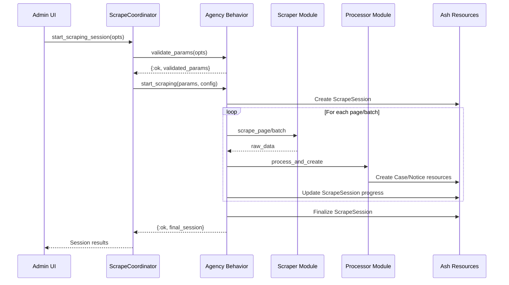

# EHS Enforcement Scraping Architecture

**Document Version**: 1.0  
**Date**: August 15, 2025  
**Status**: Implemented (Post-Standardization)

## Overview

The EHS Enforcement application uses a unified, behavior-driven scraping architecture to collect enforcement data from multiple UK regulatory agencies. This document describes the standardized module structure, data flow patterns, and architectural principles established during the August 2025 architecture standardization.

## Core Principles

### 1. **Unified Agency Patterns**
- All agencies follow identical module structure and naming conventions
- Consistent interfaces enable cross-agency functionality and easy extension
- Agency-specific logic is contained within well-defined boundaries

### 2. **Clear Separation of Concerns**
- **`scraping/`**: HTTP scraping, data processing, Ash resource creation
- **`agencies/`**: Data transformation, business logic, agency-specific helpers
- **`scraping/agencies/`**: Agency behavior routing and session management

### 3. **Behavior-Driven Design**
- `AgencyBehavior` protocol defines standard scraping interface
- Agency-specific implementations handle unique characteristics
- Unified progress tracking, error handling, and session management

### 4. **Ash Framework Integration**
- All data operations use Ash patterns (`Ash.create/2`, `Ash.update/2`, etc.)
- No direct Ecto usage - maintains Ash policy enforcement
- Consistent error handling and validation through Ash resources

## Module Structure

### **Current Unified Architecture**

```
lib/ehs_enforcement/
├── scraping/
│   ├── agencies/                    # Agency behavior implementations
│   │   ├── hse.ex                  # HSE agency behavior
│   │   └── ea.ex                   # EA agency behavior
│   ├── hse/                        # HSE scraping and processing
│   │   ├── case_scraper.ex         # HSE case HTTP scraping
│   │   ├── case_processor.ex       # HSE case processing + Ash integration
│   │   ├── notice_scraper.ex       # HSE notice HTTP scraping
│   │   └── notice_processor.ex     # HSE notice processing + Ash integration
│   ├── ea/                         # EA scraping and processing
│   │   ├── case_scraper.ex         # EA case HTTP scraping
│   │   ├── case_processor.ex       # EA case processing + Ash integration
│   │   └── historical_scraper.ex   # EA historical data scraping
│   └── resources/                  # Shared scraping resources
│       ├── scrape_session.ex       # Scraping session tracking
│       ├── processing_log.ex       # Unified processing logs
│       ├── scrape_request.ex       # Scraping request management
│       └── rate_limiter.ex         # HTTP rate limiting
├── agencies/                       # Agency-specific helpers and transformers
│   ├── hse/
│   │   ├── data_transformer.ex     # HSE data format conversion
│   │   ├── offender_matcher.ex     # HSE offender matching logic
│   │   ├── breaches.ex             # HSE breach processing helpers
│   │   ├── common.ex               # HSE shared utilities
│   │   └── notices.ex              # Legacy notice processing (deprecated)
│   └── ea/
│       ├── data_transformer.ex     # EA data format conversion
│       ├── offender_matcher.ex     # EA offender matching logic
│       └── industry_classifier.ex  # EA industry classification
└── enforcement/                    # Ash resources (Cases, Notices, Offenders)
    ├── case.ex                     # Case Ash resource
    ├── notice.ex                   # Notice Ash resource
    ├── offender.ex                 # Offender Ash resource
    └── unified_case_processor.ex   # Cross-agency case processing
```

## Agency Behavior Pattern

### **AgencyBehavior Protocol**

```elixir
@callback validate_params(keyword()) :: {:ok, map()} | {:error, term()}
@callback start_scraping(map(), map()) :: {:ok, term()} | {:error, term()}
@callback process_results(term()) :: term()
```

### **Standard Implementation Pattern**

Each agency implements three core callbacks:

#### **1. Parameter Validation**
```elixir
def validate_params(opts) do
  # Agency-specific parameter validation
  # Returns normalized parameters map
end
```

**HSE Parameters**: `start_page`, `max_pages`, `database` ("convictions", "notices", "appeals")
**EA Parameters**: `date_from`, `date_to`, `action_types` ([:court_case, :caution, :enforcement_notice])

#### **2. Scraping Execution**
```elixir
def start_scraping(validated_params, config) do
  # Create ScrapeSession for progress tracking
  # Execute agency-specific scraping workflow
  # Handle errors and session finalization
end
```

#### **3. Results Processing**
```elixir
def process_results(session_results) do
  # Format results for unified display
  # Handle cross-agency result consistency
end
```

## Data Flow Architecture

### **1. Scraping Session Lifecycle**



### **2. Data Processing Pipeline**

#### **HSE Processing Flow**
1. **Page Scraping**: `CaseScraper.scrape_page_basic/2` → basic case list
2. **Detail Enrichment**: `CaseScraper.scrape_case_details/2` → full case data
3. **Data Transformation**: `DataTransformer.transform_hse_case/1` → standardized format
4. **Offender Matching**: `OffenderMatcher.find_or_create_offender/1` → linked offender
5. **Resource Creation**: `CaseProcessor.process_and_create_case/2` → Ash Case resource

#### **EA Processing Flow**
1. **Summary Collection**: `CaseScraper.collect_summary_records_for_action_type/4` → case summaries
2. **Detail Fetching**: `CaseScraper.fetch_detail_record_individual/2` → detailed records
3. **Data Transformation**: `DataTransformer.transform_ea_record/1` → standardized format
4. **Offender Matching**: `OffenderMatcher.find_or_create_offender/1` → linked offender
5. **Resource Creation**: `CaseProcessor.process_and_create_case_with_status/2` → Ash Case resource

### **3. Progress Tracking and Monitoring**

#### **ScrapeSession Resource**
- **Real-time progress**: Updated per case/notice processed
- **Cross-agency metrics**: Standardized counters (cases_found, cases_created, cases_existing)
- **Error tracking**: Comprehensive error logging and recovery
- **PubSub integration**: Real-time UI updates via Ash PubSub

#### **ProcessingLog Resource**
- **Batch-level logging**: Detailed per-page/batch processing results
- **Agency-agnostic format**: Unified structure for all agencies
- **UI integration**: Supports unified progress display components

## Agency-Specific Implementations

### **HSE (Health and Safety Executive)**

#### **Characteristics**
- **Pagination**: Page-based scraping (10-50 results per page)
- **Databases**: Multiple databases ("convictions", "notices", "appeals")
- **Stop Logic**: Consecutive existing records threshold (default: 10)
- **Rate Limiting**: 3-second pause between pages
- **Three-stage enrichment**: Basic → Details → Breaches

#### **URL Patterns**
```
Cases: https://resources.hse.gov.uk/convictions/convictions/conviction_list.asp?PN={page}&ST=C&...
Notices: https://resources.hse.gov.uk/notices/notices/notice_list.asp?PN={page}&ST=N&...
Details: https://resources.hse.gov.uk/convictions/cases/case_details.asp?SF=CN&SV={case_id}
```

#### **Data Processing**
- **Business Type Detection**: Regex-based company type classification
- **Industry Mapping**: HSE industry categories → standard classifications  
- **Address Parsing**: UK postcode extraction and normalization
- **Breach Processing**: Multi-breach concatenation and cleaning

### **EA (Environment Agency)**

#### **Characteristics**
- **Date-range scraping**: Temporal filtering (date_from/date_to)
- **Action Type Filtering**: Court cases, cautions, enforcement notices
- **Single-request model**: All results in one API call (no pagination)
- **Company Registration**: Uses UK company registration numbers for matching
- **Environmental Context**: Water/land/air impact classification

#### **URL Patterns**
```
Search: https://environment.data.gov.uk/public-register/enforcement-action/registration?after={date}&before={date}&actionType={type}
Details: https://environment.data.gov.uk/public-register/enforcement-action/registration/{record_id}
```

#### **Data Processing**
- **Environmental Impact**: Water/land/air impact assessment
- **Legal Framework**: UK environmental act and section parsing
- **Company Matching**: Registration number-based offender linking
- **Multi-violation Detection**: Complex case reference parsing

## Error Handling and Recovery

### **Error Categories**

#### **1. Network Errors**
- **Rate limiting**: Exponential backoff with max retry attempts
- **Timeouts**: Configurable per-request timeouts (default: 30s)
- **Connection failures**: Circuit breaker pattern with recovery

#### **2. Data Processing Errors**
- **Duplicate handling**: Graceful duplicate detection and updating
- **Validation failures**: Field-level validation with detailed error logging
- **Transformation errors**: Fallback to basic data with warning logs

#### **3. Session Management Errors**
- **Session recovery**: Automatic session state restoration
- **Progress preservation**: Database-backed progress tracking
- **Graceful degradation**: Partial success handling with detailed reporting

### **Error Reporting**

#### **ProcessingLog Integration**
- **Error categorization**: Network, processing, validation error types
- **Detailed context**: Full error traces with scraping context
- **Recovery actions**: Automatic retry logic with manual intervention options

#### **PubSub Notifications**
- **Real-time alerts**: Immediate error notifications to admin interface
- **Status updates**: Progress updates with error status indication
- **Session completion**: Final status with error summary

## Configuration Management

### **ScrapingConfig Resource**
- **Per-agency settings**: Agency-specific rate limits and timeouts
- **Feature flags**: Enable/disable scraping types (manual, scheduled)
- **Performance tuning**: Batch sizes, concurrent limits, retry attempts
- **Environment-specific**: Development, staging, production configurations

### **Default Configuration Values**
```elixir
%{
  consecutive_existing_threshold: 10,
  max_pages_per_session: 100,
  network_timeout_ms: 30_000,
  max_consecutive_errors: 3,
  pause_between_pages_ms: 3_000,
  batch_size: 50
}
```

## Testing Architecture

### **Test Structure**
```
test/ehs_enforcement/
├── scraping/
│   ├── agencies/
│   │   ├── hse_test.exs          # HSE agency behavior tests
│   │   └── ea_test.exs           # EA agency behavior tests
│   ├── hse/
│   │   ├── case_scraper_test.exs # HSE scraping tests
│   │   └── case_processor_test.exs # HSE processing tests
│   ├── ea/
│   │   ├── case_scraper_test.exs # EA scraping tests
│   │   └── case_processor_test.exs # EA processing tests
│   └── workflows/
│       ├── case_scraping_integration_test.exs
│       └── notice_scraping_integration_test.exs
├── agencies/
│   ├── hse/
│   │   ├── data_transformer_test.exs # HSE transformation tests
│   │   └── offender_matcher_test.exs # HSE matching tests
│   └── ea/
│       ├── data_transformer_test.exs # EA transformation tests
│       └── duplicate_handling_test.exs # EA-specific tests
```

### **Testing Patterns**

#### **Unit Tests**
- **Scraper modules**: Mock HTTP responses, test data parsing
- **Processor modules**: Test data transformation and Ash integration
- **Matcher modules**: Test offender matching algorithms

#### **Integration Tests**
- **End-to-end workflows**: Complete scraping session lifecycle
- **Cross-agency consistency**: Unified result format validation
- **Error scenario testing**: Network failures, data corruption, session recovery

## Performance Considerations

### **Rate Limiting Strategy**
- **Respectful scraping**: Configurable delays between requests
- **Burst prevention**: Maximum concurrent requests per agency
- **Circuit breaker**: Automatic throttling on repeated failures

### **Memory Management**
- **Streaming processing**: Process cases/notices individually, not in large batches  
- **Garbage collection**: Explicit cleanup of large data structures
- **Connection pooling**: Efficient HTTP connection reuse

### **Database Optimization**
- **Batch operations**: Efficient bulk inserts for large datasets
- **Index strategy**: Optimized queries for duplicate detection
- **Connection management**: Proper Ash resource lifecycle management

## Future Extensions

### **Additional Agencies**
The architecture supports easy integration of additional agencies:

#### **SEPA (Scottish Environmental Protection Agency)**
- Follow EA patterns with Scottish-specific data formats
- Implement `EhsEnforcement.Scraping.Agencies.Sepa` behavior
- Create corresponding scraper and processor modules

#### **NRW (Natural Resources Wales)**  
- Follow EA patterns with Welsh regulatory data
- Implement bilingual content handling (English/Welsh)
- Extend environmental impact classification

### **Enhanced Features**
- **Scheduled scraping**: Cron-based automatic data collection
- **Data validation**: Cross-reference validation between agencies
- **Analytics integration**: Real-time scraping performance metrics
- **Notification system**: Alert system for significant enforcement actions

## Migration Notes

### **From Legacy Architecture (Pre-August 2025)**
The current unified architecture replaced a mixed pattern where:
- HSE notices were split between `agencies/hse/` and `scraping/hse/`
- EA case processing was located in `agencies/ea/` instead of `scraping/ea/`
- No standardized data transformation or offender matching patterns

### **Breaking Changes**
- **Module locations**: Several modules moved to standardized locations
- **Import updates**: All import statements updated to new module paths
- **Deprecated modules**: `EhsEnforcement.Agencies.Hse.Notices` marked deprecated

### **Backward Compatibility**
- **API compatibility**: All public interfaces maintained
- **Data compatibility**: No changes to database schemas or Ash resources
- **Test compatibility**: Existing test patterns preserved with updated imports

## Conclusion

The unified scraping architecture provides a robust, scalable foundation for collecting UK enforcement data from multiple regulatory agencies. The behavior-driven design enables consistent cross-agency functionality while preserving agency-specific optimizations. The clear separation of concerns and comprehensive error handling ensure reliable data collection and processing at scale.

This architecture supports the current HSE and EA integrations while providing a clear template for future agency additions, making it a solid foundation for comprehensive UK enforcement data intelligence.