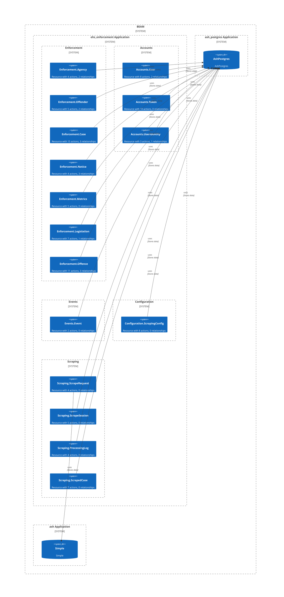

# Application - Architecture

```mermaid
C4Context

  System_Boundary("beam", "BEAM") {
    System_Boundary("ehs_enforcement", "ehs_enforcement Application") {
      System_Boundary("ehs_enforcement_enforcement", "Enforcement") {
        System("ehs_enforcement_enforcement_agency", "Enforcement.Agency", "Resource with 4 actions, 2 relationships")
        System("ehs_enforcement_enforcement_offender", "Enforcement.Offender", "Resource with 5 actions, 2 relationships")
        System("ehs_enforcement_enforcement_case", "Enforcement.Case", "Resource with 15 actions, 3 relationships")
        System("ehs_enforcement_enforcement_notice", "Enforcement.Notice", "Resource with 4 actions, 3 relationships")
        System("ehs_enforcement_enforcement_metrics", "Enforcement.Metrics", "Resource with 5 actions, 0 relationships")
        System("ehs_enforcement_enforcement_legislation", "Enforcement.Legislation", "Resource with 7 actions, 1 relationships")
        System("ehs_enforcement_enforcement_offence", "Enforcement.Offence", "Resource with 11 actions, 3 relationships")
      }
      System_Boundary("ehs_enforcement_accounts", "Accounts") {
        System("ehs_enforcement_accounts_user", "Accounts.User", "Resource with 8 actions, 2 relationships")
        System("ehs_enforcement_accounts_token", "Accounts.Token", "Resource with 10 actions, 0 relationships")
        System("ehs_enforcement_accounts_user_identity", "Accounts.UserIdentity", "Resource with 3 actions, 1 relationships")
      }
      System_Boundary("ehs_enforcement_events", "Events") {
        System("ehs_enforcement_events_event", "Events.Event", "Resource with 2 actions, 0 relationships")
      }
      System_Boundary("ehs_enforcement_configuration", "Configuration") {
        System("ehs_enforcement_configuration_scraping_config", "Configuration.ScrapingConfig", "Resource with 8 actions, 0 relationships")
      }
      System_Boundary("ehs_enforcement_scraping", "Scraping") {
        System("ehs_enforcement_scraping_scrape_request", "Scraping.ScrapeRequest", "Resource with 4 actions, 0 relationships")
        System("ehs_enforcement_scraping_scrape_session", "Scraping.ScrapeSession", "Resource with 5 actions, 0 relationships")
        System("ehs_enforcement_scraping_processing_log", "Scraping.ProcessingLog", "Resource with 4 actions, 0 relationships")
        System("ehs_enforcement_scraping_scraped_case", "Scraping.ScrapedCase", "Resource with 7 actions, 0 relationships")
      }
    }
    System_Boundary("ash_postgres", "ash_postgres Application") {
      SystemDb("ashpostgres", "AshPostgres", "AshPostgres")
    }
    System_Boundary("ash", "ash Application") {
      SystemDb("simple", "Simple", "Simple")
    }
  }
  Rel("ehs_enforcement_enforcement_agency", "ashpostgres", "uses", "Stores data")
  Rel("ehs_enforcement_enforcement_offender", "ashpostgres", "uses", "Stores data")
  Rel("ehs_enforcement_enforcement_case", "ashpostgres", "uses", "Stores data")
  Rel("ehs_enforcement_enforcement_notice", "ashpostgres", "uses", "Stores data")
  Rel("ehs_enforcement_enforcement_metrics", "ashpostgres", "uses", "Stores data")
  Rel("ehs_enforcement_enforcement_legislation", "ashpostgres", "uses", "Stores data")
  Rel("ehs_enforcement_enforcement_offence", "ashpostgres", "uses", "Stores data")
  Rel("ehs_enforcement_accounts_user", "ashpostgres", "uses", "Stores data")
  Rel("ehs_enforcement_accounts_token", "ashpostgres", "uses", "Stores data")
  Rel("ehs_enforcement_accounts_user_identity", "ashpostgres", "uses", "Stores data")
  Rel("ehs_enforcement_events_event", "ashpostgres", "uses", "Stores data")
  Rel("ehs_enforcement_configuration_scraping_config", "ashpostgres", "uses", "Stores data")
  Rel("ehs_enforcement_scraping_scrape_request", "simple", "uses", "Stores data")
  Rel("ehs_enforcement_scraping_scrape_session", "ashpostgres", "uses", "Stores data")
  Rel("ehs_enforcement_scraping_processing_log", "ashpostgres", "uses", "Stores data")
  Rel("ehs_enforcement_scraping_scraped_case", "ashpostgres", "uses", "Stores data")

```

---

**Generated**: 2025-10-20 16:10:13.361527Z

**Regenerate**: `mix diagrams.generate --domain application`
