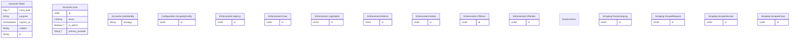

# Application - Entity relationship

```mermaid
erDiagram
  "EhsEnforcement.Accounts.Token"["Accounts.Token"] {
    Map？ extra_data
    String purpose
    UtcDatetime expires_at
    String subject
    String jti
  }
  "EhsEnforcement.Accounts.User"["Accounts.User"] {
    UUID id
    CiString email
    Boolean？ is_admin
    String？ primary_provider
  }
  "EhsEnforcement.Accounts.UserIdentity"["Accounts.UserIdentity"] {
    String strategy
  }
  "EhsEnforcement.Configuration.ScrapingConfig"["Configuration.ScrapingConfig"] {
    UUID id
  }
  "EhsEnforcement.Enforcement.Agency"["Enforcement.Agency"] {
    UUID id
  }
  "EhsEnforcement.Enforcement.Case"["Enforcement.Case"] {
    UUID id
  }
  "EhsEnforcement.Enforcement.Legislation"["Enforcement.Legislation"] {
    UUID id
  }
  "EhsEnforcement.Enforcement.Metrics"["Enforcement.Metrics"] {
    UUID id
  }
  "EhsEnforcement.Enforcement.Notice"["Enforcement.Notice"] {
    UUID id
  }
  "EhsEnforcement.Enforcement.Offence"["Enforcement.Offence"] {
    UUID id
  }
  "EhsEnforcement.Enforcement.Offender"["Enforcement.Offender"] {
    UUID id
  }
  "EhsEnforcement.Events.Event"["Events.Event"] {
  }
  "EhsEnforcement.Scraping.ProcessingLog"["Scraping.ProcessingLog"] {
    UUID id
  }
  "EhsEnforcement.Scraping.ScrapeRequest"["Scraping.ScrapeRequest"] {
    UUID id
  }
  "EhsEnforcement.Scraping.ScrapeSession"["Scraping.ScrapeSession"] {
    UUID id
  }
  "EhsEnforcement.Scraping.ScrapedCase"["Scraping.ScrapedCase"] {
    UUID id
  }

```

---

**Generated**: 2025-10-20 16:10:13.858684Z

**Regenerate**: `mix diagrams.generate --domain application`
