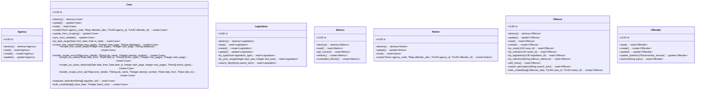

# Enforcement - Class

```mermaid
classDiagram
  class `EhsEnforcement.Enforcement.Agency`["Agency"] {
    +UUID id
    +destroy() : destroy~Agency~
    +read() : read~Agency~
    +create() : create~Agency~
    +update() : update~Agency~
  }
  class `EhsEnforcement.Enforcement.Case`["Case"] {
    +UUID id
    +destroy() : destroy~Case~
    +update() : update~Case~
    +read() : read~Case~
    +create(?Atom agency_code, ?Map offender_attrs, ?UUID agency_id, ?UUID offender_id) : create~Case~
    +update_from_scraping() : update~Case~
    +sync_from_airtable() : update~Case~
    +by_date_range(Date from_date, Date to_date) : read~Case~
    +scrape_hse_cases(?Integer max_pages, ?Integer start_page, ?String database) : create~Case~
    +scrape_hse_cases_deep(?Integer max_pages, ?Integer start_page, ?String database) : create~Case~
    +handle_scrape_error(?Map error_details, ?String job_name, ?Integer attempt_number) : create~Case~
    +scrape_ea_cases(?Date date_from, ?Date date_to, ?Atom[] action_types, ?Integer max_pages, ?Integer start_page) : create~Case~
    +scrape_ea_cases_historical(Date date_from, Date date_to, Integer start_page, Integer max_pages, ?Atom[] action_types) : create~Case~
    +handle_scrape_error_ea(?Map error_details, ?String job_name, ?Integer attempt_number, ?Date date_from, ?Date date_to) : create~Case~
    +duplicate_detection(String[] regulator_ids) : read~Case~
    +bulk_create(Map[] cases_data, ?Integer batch_size) : create~Case~
  }
  class `EhsEnforcement.Enforcement.Legislation`["Legislation"] {
    +UUID id
    +destroy() : destroy~Legislation~
    +read() : read~Legislation~
    +create() : create~Legislation~
    +update() : update~Legislation~
    +by_type(Atom legislation_type) : read~Legislation~
    +by_year_range(Integer start_year, Integer end_year) : read~Legislation~
    +search_title(String search_term) : read~Legislation~
  }
  class `EhsEnforcement.Enforcement.Metrics`["Metrics"] {
    +UUID id
    +destroy() : destroy~Metrics~
    +read() : read~Metrics~
    +get_current() : read~Metrics~
    +refresh() : create~Metrics~
    +scheduled_refresh() : create~Metrics~
  }
  class `EhsEnforcement.Enforcement.Notice`["Notice"] {
    +UUID id
    +destroy() : destroy~Notice~
    +update() : update~Notice~
    +read() : read~Notice~
    +create(?Atom agency_code, ?Map offender_attrs, ?UUID agency_id, ?UUID offender_id) : create~Notice~
  }
  class `EhsEnforcement.Enforcement.Offence`["Offence"] {
    +UUID id
    +destroy() : destroy~Offence~
    +update() : update~Offence~
    +read() : read~Offence~
    +create() : create~Offence~
    +by_case(UUID case_id) : read~Offence~
    +by_notice(UUID notice_id) : read~Offence~
    +by_legislation(UUID legislation_id) : read~Offence~
    +by_reference(String offence_reference) : read~Offence~
    +with_fines() : read~Offence~
    +search_description(String search_term) : read~Offence~
    +bulk_create(Map[] offences_data, ?UUID case_id, ?UUID notice_id) : create~Offence~
  }
  class `EhsEnforcement.Enforcement.Offender`["Offender"] {
    +UUID id
    +read() : read~Offender~
    +create() : create~Offender~
    +update() : update~Offender~
    +update_statistics(?Decimal fine_amount) : update~Offender~
    +search(String query) : read~Offender~
  }

```

---

**Generated**: 2025-10-20 16:10:06.316097Z

**Regenerate**: `mix diagrams.generate --domain enforcement`
