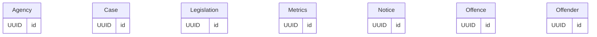

# Enforcement - Entity relationship

```mermaid
erDiagram
  "EhsEnforcement.Enforcement.Agency"["Agency"] {
    UUID id
  }
  "EhsEnforcement.Enforcement.Case"["Case"] {
    UUID id
  }
  "EhsEnforcement.Enforcement.Legislation"["Legislation"] {
    UUID id
  }
  "EhsEnforcement.Enforcement.Metrics"["Metrics"] {
    UUID id
  }
  "EhsEnforcement.Enforcement.Notice"["Notice"] {
    UUID id
  }
  "EhsEnforcement.Enforcement.Offence"["Offence"] {
    UUID id
  }
  "EhsEnforcement.Enforcement.Offender"["Offender"] {
    UUID id
  }

```

---

**Generated**: 2025-10-20 16:10:05.792699Z

**Regenerate**: `mix diagrams.generate --domain enforcement`
