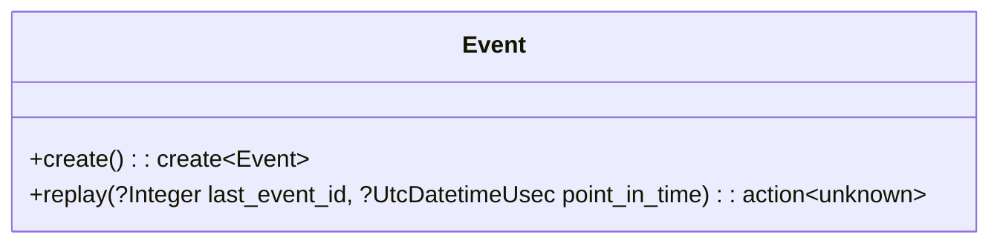

# Events - Class

```mermaid
classDiagram
  class `EhsEnforcement.Events.Event`["Event"] {
    +create() : create~Event~
    +replay(?Integer last_event_id, ?UtcDatetimeUsec point_in_time) : action~unknown~
  }

```

---

**Generated**: 2025-10-20 16:10:11.814245Z

**Regenerate**: `mix diagrams.generate --domain events`
