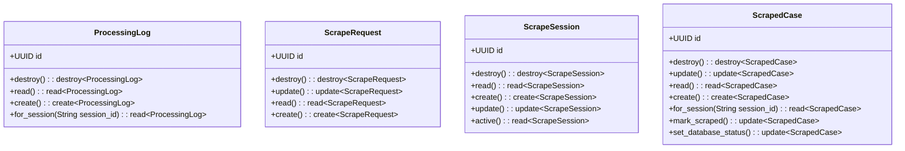

# Scraping - Class

```mermaid
classDiagram
  class `EhsEnforcement.Scraping.ProcessingLog`["ProcessingLog"] {
    +UUID id
    +destroy() : destroy~ProcessingLog~
    +read() : read~ProcessingLog~
    +create() : create~ProcessingLog~
    +for_session(String session_id) : read~ProcessingLog~
  }
  class `EhsEnforcement.Scraping.ScrapeRequest`["ScrapeRequest"] {
    +UUID id
    +destroy() : destroy~ScrapeRequest~
    +update() : update~ScrapeRequest~
    +read() : read~ScrapeRequest~
    +create() : create~ScrapeRequest~
  }
  class `EhsEnforcement.Scraping.ScrapeSession`["ScrapeSession"] {
    +UUID id
    +destroy() : destroy~ScrapeSession~
    +read() : read~ScrapeSession~
    +create() : create~ScrapeSession~
    +update() : update~ScrapeSession~
    +active() : read~ScrapeSession~
  }
  class `EhsEnforcement.Scraping.ScrapedCase`["ScrapedCase"] {
    +UUID id
    +destroy() : destroy~ScrapedCase~
    +update() : update~ScrapedCase~
    +read() : read~ScrapedCase~
    +create() : create~ScrapedCase~
    +for_session(String session_id) : read~ScrapedCase~
    +mark_scraped() : update~ScrapedCase~
    +set_database_status() : update~ScrapedCase~
  }

```

---

**Generated**: 2025-10-20 16:10:08.022554Z

**Regenerate**: `mix diagrams.generate --domain scraping`
