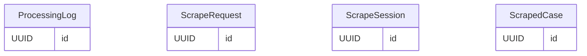

# Scraping - Entity relationship

```mermaid
erDiagram
  "EhsEnforcement.Scraping.ProcessingLog"["ProcessingLog"] {
    UUID id
  }
  "EhsEnforcement.Scraping.ScrapeRequest"["ScrapeRequest"] {
    UUID id
  }
  "EhsEnforcement.Scraping.ScrapeSession"["ScrapeSession"] {
    UUID id
  }
  "EhsEnforcement.Scraping.ScrapedCase"["ScrapedCase"] {
    UUID id
  }

```

---

**Generated**: 2025-10-20 16:10:06.587284Z

**Regenerate**: `mix diagrams.generate --domain scraping`
