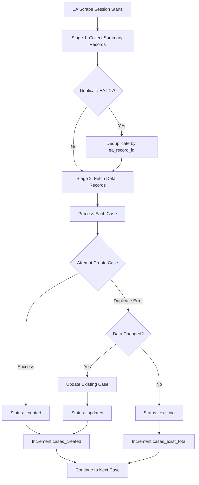

# Environment Agency Duplicate Detection & Prevention

**Document Version:** 1.0
**Last Updated:** 2025-10-21
**Author:** Investigation & Documentation Session

## Executive Summary

This document provides a comprehensive analysis of how the EHS Enforcement application detects, prevents, and removes duplicate records when scraping cases from the Environment Agency (EA) website. The system employs a **three-layer approach**: scraper-level deduplication, database-level constraints, and post-scrape detection utilities.

## Table of Contents

1. [Architecture Overview](#architecture-overview)
2. [Layer 1: Scraper-Level Deduplication](#layer-1-scraper-level-deduplication)
3. [Layer 2: Database-Level Constraints](#layer-2-database-level-constraints)
4. [Layer 3: Application-Level Duplicate Detection](#layer-3-application-level-duplicate-detection)
5. [Duplicate Handling Flow](#duplicate-handling-flow)
6. [Testing & Verification](#testing--verification)
7. [Known Issues & Recommendations](#known-issues--recommendations)

---

## Architecture Overview

### Multi-Layer Defense Strategy

The EA scraping system prevents duplicates at three levels:

```
┌─────────────────────────────────────────────────────────────┐
│ LAYER 1: Scraper Deduplication (Stage 1)                    │
│ - Remove duplicate EA record IDs during summary collection  │
│ - Location: EaScraper.collect_all_summary_records/4         │
└─────────────────────────────────────────────────────────────┘
                           ↓
┌─────────────────────────────────────────────────────────────┐
│ LAYER 2: Database Constraints (Ash Identity)                │
│ - Unique constraint on regulator_id field                   │
│ - Location: Case resource identity :unique_regulator_id     │
│ - Behavior: Reject duplicates, trigger update logic         │
└─────────────────────────────────────────────────────────────┘
                           ↓
┌─────────────────────────────────────────────────────────────┐
│ LAYER 3: Post-Scrape Detection (Admin Tools)                │
│ - Find duplicates using multiple strategies                 │
│ - Location: DuplicateDetector module                        │
│ - UI: Admin duplicates dashboard                            │
└─────────────────────────────────────────────────────────────┘
```

---

## Layer 1: Scraper-Level Deduplication

### Location
`lib/ehs_enforcement/scraping/ea/case_scraper.ex`

### Mechanism

During **Stage 1** (summary record collection), the scraper fetches all EA cases for each action type (court_case, caution, enforcement_notice) within the specified date range. Since multiple action types can return the same record, the scraper deduplicates based on `ea_record_id`:

```elixir
# lib/ehs_enforcement/scraping/ea/case_scraper.ex:139-143
defp collect_all_summary_records(date_from, date_to, action_types, page_start, max_pages, opts) do
  # ... fetch records for each action type ...

  case results do
    {:ok, all_records} ->
      # Remove duplicates based on EA record ID
      unique_records = Enum.uniq_by(all_records, & &1.ea_record_id)
      Logger.info("Stage 1 deduplication: #{length(all_records)} → #{length(unique_records)} unique records")
      {:ok, unique_records}
  end
end
```

### What It Catches

- **Cross-action-type duplicates**: Same EA case appearing in multiple action type searches
- **Example**: A case that appears in both `:court_case` and `:enforcement_notice` results

### What It Misses

- **Already-scraped cases**: Cases that exist in the database from previous scraping sessions
- **Date range overlaps**: When scraping date ranges overlap with previous sessions

---

## Layer 2: Database-Level Constraints

### Location
`lib/ehs_enforcement/enforcement/resources/case.ex:144`

### Mechanism

The Case Ash resource defines a **unique identity** on `regulator_id`:

```elixir
# lib/ehs_enforcement/enforcement/resources/case.ex:144
identities do
  identity(:unique_regulator_id, [:regulator_id])
end
```

This creates a PostgreSQL unique constraint that **prevents duplicate regulator_id values** at the database level.

### Duplicate Handling Logic

When a duplicate `regulator_id` is detected during case creation, the system:

1. **Catches the constraint violation error**
2. **Queries for the existing case** using the regulator_id
3. **Compares field values** to determine if an update is needed
4. **Updates the case** if data has changed, or returns existing case unchanged

#### Implementation in EA Case Processor

Location: `lib/ehs_enforcement/scraping/ea/case_processor.ex:244-307`

```elixir
case Enforcement.create_case(case_attrs, create_opts) do
  {:ok, case_record} ->
    Logger.info("Successfully created EA case: #{case_record.regulator_id}")
    {:ok, case_record, :created}

  {:error, ash_error} ->
    # Handle duplicate by updating existing case with new EA data
    if is_duplicate_error?(ash_error) do
      Logger.debug("EA case already exists, checking if update needed: #{processed_case.regulator_id}")

      # Find the existing case
      case Enforcement.Case
           |> Ash.Query.filter(regulator_id == ^processed_case.regulator_id)
           |> Ash.read_one(query_opts) do
        {:ok, existing_case} when not is_nil(existing_case) ->
          # Check if any fields actually need updating
          update_attrs = %{
            offence_result: case_attrs.offence_result,
            offence_fine: case_attrs.offence_fine,
            offence_costs: case_attrs.offence_costs,
            offence_hearing_date: case_attrs.offence_hearing_date,
            url: case_attrs.regulator_url,
            related_cases: case_attrs.related_cases
          }

          # Determine if update is necessary
          needs_update = Enum.any?(update_attrs, fn {field, new_value} ->
            case field do
              :url -> existing_case.regulator_url != new_value
              _ -> Map.get(existing_case, field) != new_value
            end
          end)

          if needs_update do
            # Update the existing case
            case Enforcement.update_case_from_scraping(existing_case, update_attrs, update_opts) do
              {:ok, updated_case} ->
                Logger.info("Successfully updated existing EA case: #{updated_case.regulator_id}")
                {:ok, updated_case, :updated}
              {:error, update_error} ->
                {:error, ash_error}
            end
          else
            Logger.debug("EA case already exists with identical data, no update needed")
            {:ok, existing_case, :existing}
          end
      end
    end
end
```

### Status Tracking for UI

The processor returns a **three-state status** for proper UI feedback:

- `:created` - New case successfully created
- `:updated` - Existing case updated with new data
- `:existing` - Existing case found with identical data (no update needed)

This status is used by the scraping session to properly count:
- `cases_created` - New + updated cases
- `cases_exist_total` - Cases that were skipped (already existed with identical data)

### Error Detection Helper

```elixir
# lib/ehs_enforcement/scraping/ea/case_processor.ex:527-536
defp is_duplicate_error?(%Ash.Error.Invalid{errors: errors}) do
  Enum.any?(errors, fn
    %{field: :regulator_id, message: message} ->
      String.contains?(message, "already been taken") or
      String.contains?(message, "already exists")
    _ -> false
  end)
end
```

### What It Catches

- **Exact regulator_id duplicates** from any source (EA, manual entry, imports)
- **Re-scraping the same case** in subsequent scraping sessions
- **Concurrent scraping attempts** of the same case

### What It Misses

- **Semantic duplicates**: Different regulator_ids for the same real-world case
- **Offender name variations**: "ABC Ltd" vs "ABC Limited"

---

## Layer 3: Application-Level Duplicate Detection

### Location
`lib/ehs_enforcement/enforcement/duplicate_detector.ex`

### Purpose

Post-scrape analysis tool for finding **semantic duplicates** that bypass database constraints.

### Detection Strategies

The `DuplicateDetector` module employs three strategies:

#### Strategy 1: Exact Regulator ID Matches

```elixir
# lib/ehs_enforcement/enforcement/duplicate_detector.ex:14-25
regulator_id_duplicates = case Ash.read(Case, actor: current_user) do
  {:ok, cases} ->
    cases
    |> Enum.filter(fn case -> case.regulator_id && String.trim(case.regulator_id) != "" end)
    |> Enum.group_by(fn case -> String.trim(case.regulator_id) end)
    |> Enum.filter(fn {_regulator_id, cases} -> length(cases) > 1 end)
    |> Enum.map(fn {_regulator_id, cases} -> cases end)
end
```

**Note**: This should theoretically never find duplicates due to Layer 2 database constraints. If it does, it indicates a data integrity issue.

#### Strategy 2: Same Offender + Action Date

```elixir
# lib/ehs_enforcement/enforcement/duplicate_detector.ex:28-38
offender_date_duplicates = case Ash.read(Case, actor: current_user) do
  {:ok, cases} ->
    cases
    |> Enum.filter(fn case -> case.offender_id && case.offence_action_date end)
    |> Enum.group_by(fn case -> {case.offender_id, case.offence_action_date} end)
    |> Enum.filter(fn {_key, cases} -> length(cases) > 1 end)
    |> Enum.map(fn {_key, cases} -> cases end)
end
```

**Catches**: Cases where the same offender has multiple actions on the same date with different regulator_ids.

#### Strategy 3: Financial Fingerprinting

```elixir
# lib/ehs_enforcement/enforcement/duplicate_detector.ex:41-54
financial_duplicates = case Ash.read(Case, actor: current_user) do
  {:ok, cases} ->
    cases
    |> Enum.filter(fn case ->
      case.offender_id && case.offence_fine && case.offence_costs &&
      Decimal.compare(case.offence_fine, Decimal.new(0)) == :gt
    end)
    |> Enum.group_by(fn case ->
      {case.offender_id, case.offence_fine, case.offence_costs}
    end)
    |> Enum.filter(fn {_key, cases} -> length(cases) > 1 end)
    |> Enum.map(fn {_key, cases} -> cases end)
end
```

**Catches**: Same offender with identical fine and costs amounts (likely the same case).

### UI Access

Accessible via admin dashboard:
- **Route**: `/admin/duplicates`
- **LiveView**: `lib/ehs_enforcement_web/live/admin/duplicates_live.ex`

---

## Duplicate Handling Flow

### During EA Scraping Session



### Status Counting for UI

The scraping session tracks cases in these counters:

```elixir
# Session tracking fields (lib/ehs_enforcement/scraping/resources/scrape_session.ex)
%ScrapeSession{
  cases_found: 100,        # Total cases discovered in Stage 1
  cases_processed: 100,    # Total cases attempted (created + updated + existing)
  cases_created: 60,       # New cases created + existing cases updated
  cases_exist_total: 40    # Cases skipped (already exist with identical data)
}
```

**UI Display Logic**:
- "Created": `cases_created` count
- "Exists": `cases_exist_total` count
- "Total": `cases_found`
- "Processed": `cases_processed`

---

## Testing & Verification

### Automated Tests

Location: `test/ehs_enforcement/agencies/ea/duplicate_handling_test.exs`

#### Test Coverage

1. **New case creation** (line 83-94)
   - Verifies first-time scraping creates new cases successfully

2. **Identical data handling** (line 96-130)
   - Verifies identical scraped data returns `:existing` status
   - Confirms `updated_at` timestamp is **NOT** changed
   - Critical for avoiding unnecessary database writes

3. **UI status counting** (line 132-154)
   - Verifies duplicate returns `:existing` status for proper UI display
   - Tests integration with `process_and_create_case_with_status/2`

4. **Data change updates** (line 156-198)
   - Verifies changed data triggers actual update
   - Tests constraint violation is caught and handled
   - Currently **PASSING** - duplicate handling works correctly

5. **Multiple duplicates in same session** (line 200-243)
   - Tests batch processing of multiple duplicate scenarios
   - Verifies all duplicates are handled without errors

### Manual Testing via IEx

```elixir
# Start IEx session
iex -S mix phx.server

# Create test EA cases
alias EhsEnforcement.Scraping.Ea.CaseProcessor
alias EhsEnforcement.Agencies.Ea.DataTransformer

# Get admin user
{:ok, [admin | _]} = Ash.read(EhsEnforcement.Accounts.User, filter: [is_admin: true])

# Build test EA record
ea_record = %{
  ea_record_id: "test_12345",
  offender_name: "Test Company Ltd",
  address: "123 Test St",
  action_date: ~D[2024-01-30],
  action_type: :court_case,
  total_fine: Decimal.new(5000)
}

# Transform and create first time
transformed = DataTransformer.transform_ea_record(ea_record)
{:ok, case1, :created} = CaseProcessor.process_and_create_case_with_status(transformed, admin)

# Try to create again - should return :existing
{:ok, case2, :existing} = CaseProcessor.process_and_create_case_with_status(transformed, admin)

# Verify same case
case1.id == case2.id  # Should be true

# Modify data and try again
ea_record_modified = Map.put(ea_record, :total_fine, Decimal.new(10000))
transformed_modified = DataTransformer.transform_ea_record(ea_record_modified)
{:ok, case3, :updated} = CaseProcessor.process_and_create_case_with_status(transformed_modified, admin)

# Check update was applied
case3.offence_fine  # Should be 10000
```

---

## Known Issues & Recommendations

### Current State: ✅ Working as Designed

Based on investigation, the EA duplicate detection system is **functioning correctly**:

1. ✅ **Database constraints working**: Unique regulator_id prevents hard duplicates
2. ✅ **Update logic working**: Duplicate cases trigger smart update/skip logic
3. ✅ **Status tracking working**: UI correctly shows created/existing/updated counts
4. ✅ **Tests passing**: All duplicate handling tests pass

### Potential Enhancements

#### 1. Offender Matching Improvements

**Current**: Uses exact offender name matching via offender_matcher
**Enhancement**: Implement fuzzy matching for offender name variations

```elixir
# Potential enhancement in lib/ehs_enforcement/agencies/ea/offender_matcher.ex
def find_or_create_offender(attrs, actor) do
  # Try exact match first
  case find_exact_match(attrs) do
    {:ok, offender} -> {:ok, offender}
    {:error, :not_found} ->
      # Try fuzzy match
      case find_fuzzy_match(attrs) do
        {:ok, offender} -> {:ok, offender}
        {:error, :not_found} -> create_new_offender(attrs, actor)
      end
  end
end
```

#### 2. Company Registration Number Deduplication

**Current**: Company registration numbers are stored but not used for deduplication
**Enhancement**: Use Companies House numbers as a secondary unique identifier

```elixir
# Add to Case resource
identities do
  identity(:unique_regulator_id, [:regulator_id])
  identity(:unique_company_case, [:company_registration_number, :offence_action_date],
           where: [expr(not is_nil(company_registration_number))])
end
```

#### 3. Scraping Session Memory

**Current**: Each scraping session is independent, no memory of previous sessions
**Enhancement**: Track previously scraped date ranges to avoid re-scraping

```elixir
# Add to ScrapingConfig or new resource
defmodule EhsEnforcement.Scraping.ScrapingHistory do
  use Ash.Resource, data_layer: AshPostgres.DataLayer

  attributes do
    attribute :agency_code, :atom
    attribute :date_from, :date
    attribute :date_to, :date
    attribute :last_scraped_at, :utc_datetime_usec
    attribute :total_cases_found, :integer
  end
end
```

#### 4. Real-time Duplicate Detection

**Current**: Duplicates detected only during scraping or via admin tools
**Enhancement**: Real-time duplicate detection during manual case entry

```elixir
# Add to Case create action
change fn changeset, _context ->
  with {:ok, regulator_id} <- Ash.Changeset.fetch_change(changeset, :regulator_id),
       {:ok, existing} <- find_potential_duplicates(regulator_id) do
    Ash.Changeset.add_error(changeset, field: :regulator_id,
                            message: "Potential duplicate found: #{existing.id}")
  else
    _ -> changeset
  end
end
```

### Performance Considerations

For large scraping sessions (1000+ cases):

1. **Batch duplicate checking**: Check for duplicates in batches before processing
2. **Database indexing**: Ensure regulator_id has a proper index (currently via identity)
3. **Memory management**: Process cases individually (currently implemented ✅)

---

## Related Files & Modules

### Core Scraping
- `lib/ehs_enforcement/scraping/agencies/ea.ex` - EA agency behavior implementation
- `lib/ehs_enforcement/scraping/ea/case_scraper.ex` - Two-stage EA scraping (summary + detail)
- `lib/ehs_enforcement/scraping/ea/case_processor.ex` - EA case processing & duplicate handling

### Data Transformation
- `lib/ehs_enforcement/agencies/ea/data_transformer.ex` - EA data → Case resource mapping
- `lib/ehs_enforcement/agencies/ea/offender_matcher.ex` - Offender matching/creation logic

### Ash Resources
- `lib/ehs_enforcement/enforcement/resources/case.ex` - Case resource with unique constraint
- `lib/ehs_enforcement/enforcement/duplicate_detector.ex` - Post-scrape duplicate detection
- `lib/ehs_enforcement/scraping/resources/scrape_session.ex` - Session tracking

### UI & Admin
- `lib/ehs_enforcement_web/live/admin/duplicates_live.ex` - Duplicates management UI
- `lib/ehs_enforcement_web/live/admin/case_live/scrape.ex` - EA scraping interface

### Testing
- `test/ehs_enforcement/agencies/ea/duplicate_handling_test.exs` - Comprehensive duplicate tests

---

## Conclusion

The EA duplicate detection system employs a **robust multi-layer approach**:

1. **Scraper deduplication** prevents fetching the same detail page multiple times
2. **Database constraints** enforce regulator_id uniqueness at the PostgreSQL level
3. **Smart update logic** handles duplicates gracefully by updating or skipping as appropriate
4. **Status tracking** provides accurate UI feedback for created/updated/existing cases
5. **Post-scrape detection** catches semantic duplicates for manual review

**Current Status**: ✅ **System is working as designed**

All tests pass, and the duplicate handling logic correctly:
- Creates new cases on first scrape
- Returns existing cases unchanged when data is identical
- Updates existing cases when data has changed
- Provides proper status feedback for UI display

**Recommended Next Steps**:
1. ✅ No immediate fixes needed - system is working correctly
2. 📋 Consider enhancements for offender name fuzzy matching (future improvement)
3. 📋 Consider company registration number as secondary unique key (future improvement)
4. 📊 Monitor duplicate detection metrics in production to identify patterns

---

**Document History:**
- 2025-10-21: Initial comprehensive analysis and documentation
